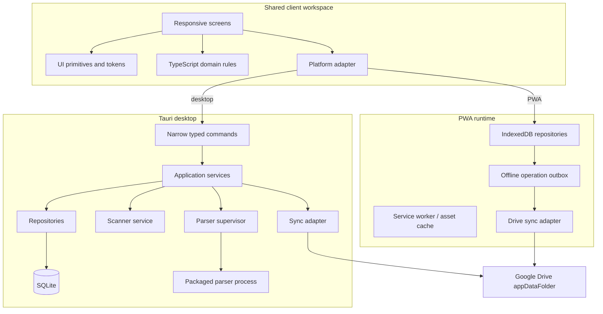
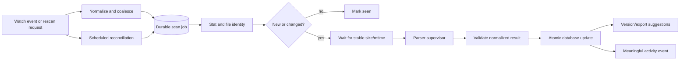

# Architecture

Status: **Accepted Phase 0 baseline; bounded PoCs may amend decisions**

## Goals and constraints

Fruitboard is a local-first metadata application. The Windows desktop owns file
discovery and FLP parsing. The PWA is a companion replica for project-management
data. FLPs are untrusted, read-only inputs and are never uploaded by metadata
sync.

The architecture optimizes for:

- safe operation around irreplaceable creative files;
- useful offline desktop behavior;
- failure isolation between UI, scanner, parser, and sync;
- thousands of project files without startup reparsing;
- shared product language and UI between desktop and PWA;
- replaceable parser and sync backends;
- a credible later macOS port.

It deliberately does not optimize Phase 1 for collaboration, server-side
accounts, background mobile scanning, or FLP mutation.

## Logical components



### Boundary rules

- The React webview has no general filesystem, shell, parser, or raw SQL access.
- Tauri commands express use cases (`add_scan_root`, `list_projects`,
  `set_project_rating`), not low-level primitives (`read_any_file`, `execute_sql`).
- Rust validates all command inputs and is the sole writer to desktop SQLite.
- The scanner emits domain-level discoveries through application services. It
  does not update UI state or tables directly.
- The parser returns versioned inert data. It never owns project identity or
  writes application metadata.
- Shared TypeScript code depends on platform ports, never Tauri globals or Drive
  APIs directly.
- Synchronization consumes durable operations from the same mutation path as
  local changes; sync is not a second write path.

The Phase 1 shell implements this boundary with a shared `PlatformPort` in
`apps/client`. Only the desktop entry adapter imports `@tauri-apps/api`; shared
React components are tested with a stateful fake port. The local `main` window
has three application permissions: health plus read/write of one startup-view
enum. It has no filesystem, shell, process, SQL, opener, or remote-origin
capability. Every command requires a versioned request and returns a versioned
success-or-error envelope; Rust generates the correlation ID and TypeScript
validates the full response before exposing it to shared code.

## Repository proposal

Use a pnpm workspace plus a Cargo workspace. Start with these boundaries and
split further only when ownership or build times justify it.

```text
fruitboard/
├─ apps/
│  ├─ client/                 # one React/Vite client; desktop and PWA entry modes
│  └─ desktop/
│     └─ src-tauri/           # Tauri configuration, commands, capabilities
├─ packages/
│  ├─ domain/                 # pure TS models, validation, filters, sync operations
│  ├─ ui/                     # tokens and accessible product components
│  └─ test-support/           # builders, fake clocks, fixtures (no personal data)
├─ crates/
│  ├─ app-core/               # Rust use cases and ports
│  ├─ storage-sqlite/         # repositories and embedded migrations/ (Issue #15)
│  ├─ scanner/                # discovery, watching, reconciliation, matching signals
│  └─ parser-protocol/        # sidecar protocol and normalized parser DTOs
├─ services/
│  └─ flp-parser/             # isolated Python package and packaging configuration
├─ fixtures/                  # manifest; approved synthetic/public fixtures only
├─ docs/
│  ├─ adr/
│  └─ research/
├─ .github/
│  ├─ ISSUE_TEMPLATE/
│  └─ workflows/
├─ ARCHITECTURE.md
├─ DATA_MODEL.md
├─ DEVELOPMENT.md
├─ FLP_PARSER.md
├─ ROADMAP.md
├─ SECURITY.md
└─ SYNC.md
```

`apps/client` is one product client, not two page trees. It may expose a
desktop entry and a PWA entry so platform-only routes and service-worker code do
not enter the desktop bundle. Responsive navigation shells can differ while
screen content and domain vocabulary remain shared.

Phase 1 Issue #11 established the root pnpm/Cargo manifests and lockfiles.
Issue #12 adds `apps/client` and `apps/desktop/src-tauri` because they now own the
shared client and native shell behavior. Issue #13 adds `packages/ui` when the
first shared token vocabulary becomes real. It also gives the desktop entry a
hash-based React Router data router so bundled navigation needs no server
fallback. Issue #14 keeps the first command, error, logging, and job primitives
inside the desktop crate until a second consumer makes a crate split useful.
Issue #15 adds `crates/storage-sqlite` so database tests run without the desktop
runtime. It owns the minimal settings schema, migration ledger, bundled SQLite,
and backup/recovery API. Tauri resolves local app data and owns the database
behind a Mutex. Issue #16 connects that repository to exact read/write command
contracts and an accessible Preferences control without exposing paths, SQL,
connections, or recovery authority to the renderer.
The remaining proposed package/crate directories are still created only by the
PR that first owns their behavior; empty architectural scaffolding remains
deliberately avoided.

## Desktop framework evaluation

| Criterion | Tauri 2 | Electron | Product-specific assessment |
| --- | --- | --- | --- |
| Renderer | OS webview (WebView2 on Windows, WebKit on macOS) | Bundled Chromium | Electron is more uniform; Tauri needs webview compatibility tests |
| Native authority | Rust commands and capability ACL | Node main/preload IPC | Rust is a good fit for durable scanner/storage services and narrow privileges |
| Distribution | Native installer plus app resources/sidecars | Chromium + Node + app bundle | Tauri should be smaller, though Python packaging may dominate |
| File watching | Rust `notify`/Win32 integration | Mature Node ecosystem | Both are viable; reconciliation is required either way |
| Python process | Supported external binary/sidecar | Child/utility process | Both need packaging, protocol, supervision, and signing |
| Security surface | Explicit command permissions/capabilities; system webview patch channel | Strong sandbox available, but ships Node/Chromium and needs careful IPC/preload hardening | Tauri gives the preferred least-privilege shape |
| Team cost | Rust and multi-toolchain expertise required | Predominantly TypeScript/Node | Tauri has higher initial engineering cost |
| macOS future | Supported with WebKit and native bundling | Supported | Neither removes parser/signing/filesystem portability work |

### Recommendation

Choose Tauri 2. The application needs a long-lived native scanner, controlled
process supervision, secure storage, and SQLite ownership; those needs make the
Rust core useful rather than incidental. Do not choose Electron solely to avoid
the parser language boundary: Electron would still need a Python or replacement
parser boundary.

Revisit only if the Phase 1 packaging spike finds a blocking issue in WebView2,
audio playback, sidecar signing/lifecycle, accessibility, or installer support.
Electron remains the documented fallback. Tauri uses WebView2 on Windows and
has platform-scoped capabilities; Electron's own security guide emphasizes that
Node and filesystem authority must be isolated from renderer content.

Issue #18 completes the bounded P0-G packaging smoke with a separately
identified, unsigned current-user NSIS build. The installed foundation remained
responsive, preserved its Rust-owned database through uninstall/reinstall, and
ran a zero-dependency inert external binary through Rust-only Tauri shell-plugin
access. The renderer still has no shell/process permission. WebView2 reported
the expected media capability signals and the 2.47 MiB installer/8.29 MiB
installation did not reveal a framework blocker. This supports ADR-001 without
making a signing, updater, production-parser, playback, or macOS claim; detailed
evidence is in `docs/review/issue-18/`.

## Frontend choices

| Concern | Choice | Reason |
| --- | --- | --- |
| UI | React 19 + strict TypeScript | Mature ecosystem, current stable line, shared desktop/PWA client |
| Build | Vite | Direct Tauri fit, static PWA output, fast workspace development |
| Routing | React Router, current stable data-router APIs | Route-level loading/error boundaries without requiring a server framework |
| Async server/platform state | TanStack Query | Cache/invalidation layer over ports; not the source of truth |
| Accessible behavior | React Aria Components | Unstyled, keyboard/touch/screen-reader behavior without imposing a visual brand |
| Styling | Vanilla CSS layers/modules + custom-property tokens | Native platform performance, inspectable output, no runtime CSS engine |
| Forms/schema | React Hook Form + Zod at UI/IPC boundaries | Explicit validation; domain invariants still live in domain/application code |
| Icons | Lucide with a wrapped icon primitive | Consistent sizing and accessible labeling; replaceable |
| Large lists | Add TanStack Virtual only after measured need | Avoid early complexity; design list APIs to permit it |
| PWA | Vite PWA/Workbox integration, introduced in Phase 12 | Versioned shell caching and explicit update UX |
| Browser store | IndexedDB through a repository adapter; likely Dexie | Transactional offline records and outbox; verify library at Phase 11/12 |

Pin exact versions and commit lockfiles in Phase 1. Use Node 24 LTS rather than
the currently installed Node 26 Current release. Avoid Redux unless observed
cross-screen client state warrants it; persisted product data belongs in a
repository, and small ephemeral state can remain local or use a small store.

The light-only visual system starts with semantic tokens: color roles, type
scale, spacing, radii, borders, shadows, motion, focus rings, z-order, and
control sizes. Components must cover default, hover, focus-visible, pressed,
disabled, loading, empty, and error states. Product screens are not blocked on
a comprehensive design-system project. Dark mode is deferred, not rejected;
its later evaluation must preserve contrast, scalable text, focus visibility,
and other accessibility requirements rather than being treated as a cosmetic
theme swap.

## Desktop application services

The Rust layer exposes use-case-oriented ports:

- `ProjectRepository`, `MetadataRepository`, and `ActivityRepository`;
- `ScanRootRepository` (root storage implemented in #34; traversal, watcher,
  and scheduler remain later slices) and `ScanScheduler`;
- `FlpParser` (adapter interface, independent of PyFLP);
- `FileIdentityProvider` (platform-specific implementation);
- `ExportMatcher` and `VersionSuggestionEngine`;
- `WorkActivityTracker`;
- `SyncBackend` (Drive is one adapter);
- `SecureSecretStore`, `Clock`, and `IdGenerator`.

### Phase 1 command foundation

Issue #14 establishes the boundary before product commands arrive:

- every response is `{ schemaVersion, status, correlationId, data | error }`;
- the stable error vocabulary is `invalid_request`, `cancelled`, `not_found`,
  `conflict`, `unavailable`, and `internal`, with fixed user text and retry
  semantics; native diagnostics are not serialized to the renderer;
- correlation and job identifiers are opaque UUIDv7 values with distinct
  prefixes; deterministic clocks and ID/error/log fakes support unit tests;
- a command panic is contained and becomes `internal`; logging failure cannot
  fail the command, and the process panic hook omits panic payloads;
- the job skeleton permits only queued, running, cancellation-requested,
  cancelled, completed, and failed transitions. Progress contains only the two
  opaque IDs, state, completed units, and an optional total.

No scanner job, event transport, persistence, background queue, or product
activity is implemented by this foundation. Later long operations will return
job IDs and publish coarse progress events, and the UI will be able to request
cooperative cancellation. Closing a window must not leave partially committed
metadata: parsing results are validated and persisted in a single transaction.

At the client edge, invalid native envelopes and unknown codes become the fixed
`internal` error. Expected command failures stay contained in the platform port.
Unexpected render failures reach the top-level React error boundary, whose root
callbacks deliberately do not print the untrusted `Error` object. Because data
routers catch render failures before an outer React boundary can see them, the
root route also owns the same safe error element and the `RouterProvider` error
callback discards raw payloads. No renderer diagnostic transport or crash
reporter exists in Phase 1.

Issue #16 proves the first complete application use case through that boundary.
`get_startup_view` and `set_startup_view` accept exact schema-versioned objects
and return only `home`, `library`, `board`, or `preferences`. The service locks
the one native database owner and calls its typed repository transaction. On an
unrouted desktop launch, the client reads the saved value before constructing
the hash router; an explicit hash deep link wins. Loading, safe retry/fallback,
default, save-success, and save-error states are owned by shared React code.
Rust close/reopen tests prove persistence, while adapter and component tests use
the same contract through native and fake ports.

## Scanner architecture

### Pipeline



1. A root is explicitly selected and stored with an enabled flag and scan
   policy. Canonical paths are device-local. Step 1 is implemented in #34
   (`pick_scan_root`, `list_scan_roots`, `add_scan_root`, `remove_scan_root`
   through migration 002): the native folder picker runs off the main thread,
   cancellation yields a null selection, duplicates and ancestor/descendant
   overlaps are rejected, unavailable paths are refused, and removal deletes
   configuration only. Steps 2-7 remain later slices.
2. Initial reconciliation enumerates `.flp` files asynchronously in bounded
   batches. It records a scan generation and marks files seen.
3. A native recursive watcher supplies low-latency invalidations. Events are
   normalized and debounced per path; they are never accepted as complete truth.
4. The scheduler waits until size and mtime settle, then creates a parse job only
   when the cheap fingerprint changed.
5. Parser results are validated, stored as an immutable snapshot, and promoted
   to current only in one transaction.
6. Startup, resume from sleep, watcher overflow/error, root reconnection, and a
   low-frequency idle schedule trigger reconciliation.
7. A file becomes `missing` only after a successful reconciliation of an
   available root. Missing is reversible. It is never a delete.

Use Rust's cross-platform `notify` abstraction initially; on Windows it selects
`ReadDirectoryChangesW`. Keep the watcher behind a port so a targeted Win32
implementation or polling fallback can replace it. The native API explicitly
requires enumeration after a notification buffer overflow, and network/virtual
filesystems may not emit reliable events.

### Fingerprint tiers

- **Cheap fingerprint:** normalized locator, byte size, modified timestamp, and
  observed filesystem identity. This avoids almost all startup parsing.
- **Quick content fingerprint:** BLAKE3 over size plus sampled beginning/end
  chunks, used only for move/duplicate candidates. It is evidence, not identity.
- **Full content hash:** streamed BLAKE3 for exact duplicate confirmation or
  when already reading the whole file. Never hash every file every startup.

On Windows, record volume serial + file ID when available. Microsoft documents
that these can compare two paths on a volume, but network/virtual providers may
fail or behave differently. P0-E determines where this signal is trustworthy.

### Google Drive for Desktop roots

Mirrored files behave like ordinary local files. Streamed files may be virtual,
unavailable while Drive is stopped, and hydrated by reads. Before parsing, check
Windows offline/recall attributes where possible. Default to `defer` for an
unhydrated placeholder and offer an explicit root policy such as “download
online-only projects for analysis.” P0-D must verify DriveFS behavior rather
than relying only on generic Windows flags.

### Queueing and failure behavior

- Persist scan jobs and attempts so a crash cannot lose work.
- Concurrency is configurable and bounded; default to one parser job until
  memory and DriveFS behavior are measured.
- Use exponential retry for transient sharing/permission failures with a cap and
  a visible retry action.
- Parser crash, timeout, malformed JSON, unsupported format, and validation
  failure are per-file outcomes.
- Keep diagnostic logs with correlation IDs, redacted paths by default, bounded
  retention, and user-controlled export.
- Watcher bursts and technical retries do not create activity timeline entries.

## Project and version identity

`Project` is the user-managed song/work. `ProjectFile` is a version-bearing FLP.
`FileLocation` says where a file is available on a particular device. All have
stable UUIDv7 IDs; no path is a primary key.

Discovery initially creates an ungrouped logical project for each file. A
suggestion engine compares candidate pairs from the same/nearby folders and
time window, avoiding an all-pairs scan.

Signals and initial qualitative weights:

- normalized filename stem after stripping conservative version suffixes:
  strong;
- stable filesystem ID after a rename/move: definitive locator continuation,
  not song grouping;
- exact full hash: exact duplicate file, strong duplicate evidence;
- folder proximity and modification chronology: moderate;
- extracted title: moderate when non-generic;
- plugin/channel/pattern/sample-set similarity: moderate after Phase 3;
- conflicting manual rejection or clearly different extracted titles: strong
  negative.

The engine stores evidence, model/ruleset version, score, and thresholds:
`unlikely`, `review`, `strong suggestion`. It never permanently merges. Confirm,
reject, merge, and split are explicit operations with reversible history.
Rejected evidence is retained so rescans do not nag the user again unless the
ruleset materially changes.

## Work-time tracking

Use three clearly labeled concepts:

1. **Tracked work time:** prospective sessions observed by Fruitboard or entered
   manually. This is the only value included in “hours tracked.”
2. **Estimated historical activity:** dates and clusters inferred from file
   timestamps or existing versions. It conveys activity, never hours.
3. **FL embedded time value:** parser-extracted metadata with parser/version and
   confidence. It is informational and is not silently added to tracked time.

For prospective sessions, combine an app-launched “Open in FL Studio” signal,
the FL Studio process/window state, file modifications, and user idle time. A
session starts when evidence indicates the project became active, pauses after a
configurable idle interval, and ends after FL Studio closes or sustained
inactivity. Ambiguous concurrent projects are flagged for confirmation. Users
can edit, split, merge, or delete sessions. The heuristic version and evidence
remain auditable.

Limitations: FL Studio may be open without active work, autosaves/backups may
not identify the foreground project, modifications can be copied from another
device, and process presence cannot prove attention. Windows process/window APIs
will need a separate macOS adapter later.

## Audio export discovery

Enumeration records WAV, MP3, and FLAC candidates near a project without reading
audio bodies. Matching scores:

- normalized basename/token similarity;
- same folder or known export subfolder;
- version suffix compatibility;
- export mtime after the relevant FLP save;
- duration plausibility once cheap media metadata is available;
- penalties for stems (`kick`, `bass`, numbered mixer names), tiny files, and
  unrelated folder distance.

Store candidates separately from confirmed `ExportedAudio` associations. A high
score may be shown as “likely,” never silently confirmed. Manual association or
rejection is authoritative. Hash only to confirm duplicates. Desktop playback
uses a scoped asset protocol or safe local stream rather than exposing arbitrary
`file://` access. Mobile previews are a later explicit, size-limited opt-in.

## Performance and observability

- Indexed queries serve screens; no filesystem access occurs during UI renders.
- Parse snapshots cache expensive results and include parser/schema versions so
  reparsing can be scheduled selectively.
- Paginate by stable cursor; virtualize only after realistic profiling.
- Issue #14 writes allowlisted JSONL command records with severity, operation,
  version, correlation ID, optional job/error fields, and a bounded redacted
  diagnostic. Command errors use fixed diagnostic codes; redacted contexts are
  represented by a type that cannot contain an unprocessed string. A path signal
  replaces the entire diagnostic rather than attempting to retain free-text
  fragments. Defaults are 1 MiB per file, five total files, and 14 days. The
  first record retains the active file's start time across restarts.
- Future scanner/storage logs may add opaque root/file IDs, but not raw request
  or binary payload fields. Full paths require an explicit diagnostic-export
  choice after preview; no export or telemetry exists yet.
- Maintain separate operational scan logs and human activity events.
- Measure discovery rate, parse latency/error class, queue depth, database query
  latency, sidecar restarts, and sync backlog locally. Do not transmit metrics.

## External references

- [Tauri capabilities](https://v2.tauri.app/security/capabilities/)
- [Tauri external binaries](https://v2.tauri.app/develop/sidecar/)
- [Tauri Windows prerequisites](https://v2.tauri.app/start/prerequisites/)
- [Electron process model](https://www.electronjs.org/docs/latest/tutorial/process-model)
- [Electron security checklist](https://www.electronjs.org/docs/latest/tutorial/security)
- [`notify` platform watcher documentation](https://docs.rs/notify/latest/notify/)
- [Windows `ReadDirectoryChangesW`](https://learn.microsoft.com/en-us/windows/win32/api/winbase/nf-winbase-readdirectorychangesw)
- [Windows file identity](https://learn.microsoft.com/en-us/windows/win32/api/fileapi/nf-fileapi-getfileinformationbyhandle)
- [Windows cloud/offline file attributes](https://learn.microsoft.com/en-us/windows/win32/fileio/file-attribute-constants)
- [Google Drive streaming and mirroring](https://support.google.com/drive/answer/13401938)
