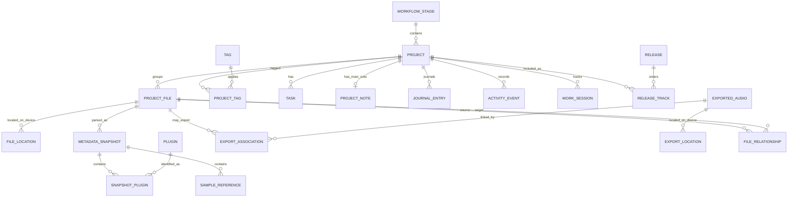

# Data model

Status: **Accepted logical baseline; Phase 2 execution foundation is shipped**

## Implemented local foundation

Issue #15 adds `crates/storage-sqlite`, using pinned `rusqlite` 0.40.2 with
bundled SQLite 3.53.2. Native startup opens
`app_local_data_dir()/storage/fruitboard.db`; Windows resolves this below the
current user's local application data, outside roaming/Drive locations.

The executable schema is version 5. Migration 005 is the shared Phase 2
integration boundary; its exact locator, timestamp, identity, job/run, and
root-scoped pagination contract is documented in
[`docs/PHASE_2_INTEGRATION_CONTRACT.md`](docs/PHASE_2_INTEGRATION_CONTRACT.md).

| Table | Fields and constraints | Classification |
| --- | --- | --- |
| `schema_migration` | Positive version primary key, unique name, exact committed SQL | Device-local migration ledger |
| `app_settings` | Singleton primary key fixed to 1; `startup_view` constrained to `home`, `library`, `board`, or `preferences` | Device-local preference |
| `scan_root` | Stable root ID, display name, canonical path, enabled flag, availability and safe error; execution configuration revision and generation | Device-local root configuration |
| `scan_session` | Process session ID and start/end timestamps | Device-local execution fence |
| `scan_job` | One active queued/running job per root, retry chain/attempt budget, due time, follow-up and cancellation flags | Device-local durable queue |
| `scan_run` | Run ID, root generation/revision, session ID, lease token/deadline, terminal outcome | Device-local leased attempt |
| `project_file` | Minimal UUIDv7 file metadata used by the filesystem-only publication checkpoint | Device-local committed read model |
| `file_location` | Per-locator-key/display-relative location, bounded decimal identity, nanosecond metadata, present or missing state, last-seen run, and detached-root history | Device-local committed read model |
| `scan_stage` | Run-owned captured fences, bounded counters, and open/published/discarded state | Device-local staging ledger |
| `scan_stage_observation` | Bounded locator-key/display-relative metadata observations keyed by run and locator | Device-local staging data |

All shipped tables are STRICT. The preference defaults to Home. The execution
tables use partial and due-time indexes for one active job per root and bounded
lease/queue recovery. Staging and publication tables are bounded by the
filesystem-only checkpoint and remain outside the renderer.
The singleton key is infrastructure identity, not a domain entity UUID.
There is no foreign-key relationship between these two tables; foreign-key
enforcement is enabled on every connection and tested with temporary relational
tables. The broader logical product tables below remain proposals; migrations
004 and 005 only ship the small device-local execution/publication subset
listed above.

Rust exposes typed preference methods and keeps the connection and transaction
closure private. Issue #16 connects them to exact `get_startup_view` and
`set_startup_view` commands through the one native database owner. IPC carries
only a schema version and the closed startup-view enum; no database identity,
path, SQL, connection, or recovery capability crosses the boundary. The shared
client restores this value on an unrouted desktop launch and lets the user edit
it in Preferences. No preference is syncable yet.

SQLite uses DELETE rollback journaling, `synchronous=FULL`, foreign keys,
`trusted_schema=OFF`, and a two-second busy timeout. A process-lifetime file
lock gives this application one native owner per data directory; a Mutex in
the Tauri host serializes access. WAL is rejected even though the embedded
version meets the policy floor.

Migrations are embedded from `crates/storage-sqlite/migrations/`. The runner
checks the application ID, `user_version`, and the complete ordered ledger,
then commits all pending SQL, seeds, ledger rows, and the version in one
IMMEDIATE transaction. Changed history, unrelated databases, and newer schemas
are refused. Tests cover v0 through v4 fixtures, including migrations 003–005
preserving roots/preferences, converting legacy publication fields with
checked bounds, and rolling back after a later failure.

Before upgrading an existing schema, the SQLite backup API creates a verified
snapshot in `storage/backups/`. Backup failure prevents the upgrade. Completed
files use UUID names ending in `.backup.db`; unfinished `.pending.db` files
are never recovery candidates. Backups are preserved until explicitly managed;
there is no automatic pruning or repair. Integrity and foreign-key checks run
at migration, backup, and recovery boundaries, not on every normal startup.

`Database::recover_to` validates a completed backup and copies it through SQLite
into a staged database in a fresh native-selected application-data location.
It publishes the recovered database only after validation and any forward
migrations succeed. Recovery refuses a destination containing `fruitboard.db`
or any of its `-journal`, `-wal`, or `-shm` companions, even if empty. The check
runs under the owner lock before staging; all existing files are preserved.
An orphan hot journal could otherwise replay old pages over the restored data
on the first SQLite read. Original
databases, corrupt data, and backups remain available for diagnosis. A future
native recovery workflow must own selecting and adopting that location.

Tests cover rollback after SQL failure, process termination before commit,
foreign keys, transaction commit/rollback, settings across reopen, Unicode
locations, backup failure, and recovery after synthetic corruption. Independent
regressions verify refusal and preservation of each destination artifact; a
real hot-journal fixture proves that stale pages can replace Library with Home
if recovery ignores the companion. Process
termination evidence is not a hardware power-loss qualification.
Projects, workflows, parser snapshots, tombstones, notes, and FTS remain
deferred to their owning slices. Migrations 003 and 004 provide durable
execution plus a fenced staging/publication boundary; they do not make the
reconciliation core a production scanner.

## Modeling principles

- A logical song (`project`) is not a file (`project_file`), and a file is not a
  device path (`file_location`).
- Every domain entity has a stable UUIDv7 string ID. Paths, filenames, Drive
  IDs, and hashes are attributes, not primary keys.
- Extracted facts live in immutable parser snapshots. User-authored values live
  on domain entities or explicit overrides. Inferences live in suggestions with
  evidence. The three are never collapsed into one unexplained value.
- Missing, archived, abandoned, and deleted are distinct states.
- Syncable and device-local data are classified at the table/field level.
- Application mutations and their sync operation are committed atomically.
- General application timestamps are UTC Unix milliseconds. Filesystem change
  detection uses signed Unix nanoseconds in the migration-005 storage boundary
  so adjacent writes remain distinguishable; user-entered calendar dates
  remain ISO local dates when time zone semantics would be misleading.
- Deletions of syncable records use tombstones long enough for offline replicas.

## Entity overview



The diagram omits operational, artwork, custom-field, and sync tables for
readability.

## Provenance and effective values

Do not build a generic entity-attribute-value store for core fields. Instead:

- `project` stores authoritative manual/product fields such as display name,
  stage, progress, rating, priority, favorite, genre override, key override, and
  release intent.
- `metadata_snapshot` stores extracted title, BPM, FL version, embedded project
  time, arrangement estimates, and structural counts.
- suggestion tables store inferred genre/key/version/export candidates with
  algorithm version, score, evidence, and review state.
- the query/application layer returns an effective value envelope where useful:

```json
{
  "value": 122.0,
  "provenance": "extracted",
  "confidence": "high",
  "sourceId": "snapshot UUID",
  "observedAt": "2026-09-04T16:00:00Z",
  "status": "available"
}
```

Allowed provenance values are `manual`, `extracted`, and `inferred`. Availability
is separate: `available`, `unavailable`, `unsupported`, or `failed`. A manual
override wins presentation but does not delete the extracted suggestion.

## Core tables

Fields below are a logical starting point, not executable SQL. All syncable
tables also carry `created_at_ms`, `updated_hlc`, `updated_by_device_id`, and
nullable `deleted_at_ms` unless explicitly immutable.

### Identity and workflow

`project`

- `id` primary key
- `display_name` required, user-authoritative
- `workflow_stage_id` foreign key
- `progress_percent` integer, nullable, check 0–100
- `rating` integer, nullable, check 1–5
- `priority` check `none|low|medium|high`
- `is_favorite` boolean
- `disposition` check `normal|abandoned|deprecated`
- `archived_at_ms` nullable; archive is not deletion
- manual musical fields: `genre`, `subgenre`, `musical_key`, `scale`, `mood`,
  `artist_alias`, `label_name`, `target_release_date`, `release_date`
- `current_file_id` nullable foreign key chosen by user/application policy

`workflow_stage`

- `id`, `name`, `rank_key`, `built_in_key` nullable
- `is_terminal`, `is_archived_stage`
- deletion is rejected while referenced unless a replacement stage is supplied

`project_file`

- `id`, `project_id`
- `display_filename`, `extension` (initially always `.flp`)
- `byte_size`, `filesystem_created_at_ms`, `filesystem_modified_at_ms`
- `availability` summarized as `available|missing|offline|permission_denied`
- `full_content_hash` nullable and `quick_fingerprint` nullable
- `current_snapshot_id` nullable
- no absolute path in the sync projection

`file_location` — device-local

- `id`, `project_file_id`, nullable `scan_root_id`, nullable
  `detached_scan_root_id`
- `locator_key` is the boundary-owned `LocatorKeyV1`; `relative_path` is the
  display spelling; `normalized_path` is retained as v4 migration-history data
- `byte_size`, legacy `modified_at_ms`, and checked `modified_at_ns`
- legacy `volume_id`/`filesystem_file_id`, plus nullable bounded-decimal
  `identity_volume_serial`/`identity_file_id`
- `presence` check `present|missing`, `last_seen_scan_run_id`,
  `last_seen_at_ms`, `created_at_ms`, and `updated_at_ms`
- active rows use the unique `file_location_active_locator` index on
  `(scan_root_id, locator_key COLLATE BINARY)`; detached rows are excluded
- `file_location_root_presence_locator` indexes
  `(scan_root_id, presence, locator_key COLLATE BINARY)`
- `file_location_encoded_identity` is a non-unique lookup on
  `(identity_volume_serial, identity_file_id)`; hardlink aliases
  keep one location row each: availability is tracked per path, so
  when one alias disappears, the other remains available
- migration 005 replaces normalized-path staging indexes with the unique
  `scan_stage_observation_locator` `(run_id, locator_key COLLATE BINARY)` and
  ordered `scan_stage_observation_locator_order` `(run_id, locator_key
  COLLATE BINARY, id)` indexes

Migrations 004 and 005 implement a deliberately smaller device-local subset for
the filesystem-only checkpoint: no absolute path is exposed, and
`file_location` stores a boundary-owned locator key separately from its
display-relative spelling, nanosecond metadata, bounded decimal identity,
`present|missing` state, and last-seen run markers. Detached root history keeps
the former root ID after configuration removal. The execution boundary rejects
cancelled or invalidated runs; traversal must withhold publication for offline,
denied, partial, or resource-limited enumerations.

`file_relationship`

- `id`, `from_project_file_id`, `to_project_file_id`
- `kind` check `version_of|duplicate_of|derived_from`
- `source` check `manual|confirmed_suggestion`
- `created_at_ms`, `reversed_at_ms` nullable

`version_suggestion` — local/recomputable except review decisions

- candidate file/project IDs, `ruleset_version`, `score`
- `band` check `unlikely|review|strong`
- `state` check `pending|confirmed|rejected|expired`
- JSON `evidence` using a versioned schema
- a rejection fingerprint prevents the same suggestion from recurring

### Parser snapshots and dependencies

`metadata_snapshot` — immutable after completion

- `id`, `project_file_id`
- input fingerprint, parser adapter ID/version, protocol version, schema version
- `outcome` check `success|partial|unsupported|failed`
- parsed timestamps and duration; failure category and safe diagnostic code
- extracted project title/comments/author/genre where available
- FL Studio version/build, BPM, PPQ, time signature
- duration estimate milliseconds, bar estimate, estimate confidence/method
- FL embedded time value and explicit confidence; never tracked work
- counts for arrangements, patterns, channels, playlist/mixer tracks,
  automation, markers, MIDI notes/controllers
- `diagnostic_summary_json`; raw traceback/log stays device-local

`arrangement_summary`

- `id`, `metadata_snapshot_id`, parser-local stable ordinal, name
- selected flag, raw maximum end ticks, estimated duration/bar count,
  uncertainty reason

`plugin`

- canonical `id`, normalized name, display name, vendor nullable
- kind `instrument|effect|unknown`
- format `native|vst2|vst3|other|unknown`
- normalized plugin identifier nullable
- uniqueness is conservative; aliases remain separate until evidence supports a
  merge

`plugin_alias`

- `id`, `plugin_id`, observed name/identifier, normalization version

`snapshot_plugin`

- `metadata_snapshot_id`, `plugin_id`, role, instance count
- `missing_state` check `present|missing|unknown` (only when detectable)
- source locations/counts; never stores or loads plugin DLL content

`sample_reference`

- `id`, `metadata_snapshot_id`, display basename, normalized extension
- reference form `absolute|relative|data_path|unknown`
- missing state and optional non-sensitive relative hint
- absolute resolved location belongs in device-local `dependency_location` and is
  excluded from sync by default

### Project management

`project_note`

- `project_id` unique
- versioned structured-document JSON and derived plain text for search
- sanitization schema version and base revision for conflict detection

`journal_entry`

- `id`, `project_id`, `occurred_at_ms`, structured body, derived plain text
- editable with revision history; timestamp and created time are separate

`task`

- `id`, `project_id`, title, notes, `completed_at_ms`, `due_date`, `rank_key`
- category is deferred; stable IDs make it additive

`tag`, `project_tag`

- tag `id`, display name, normalized name, optional color later
- unique normalized live name; join records have their own sync metadata so
  concurrent add/remove behavior is defined

`project_collaborator`

- `id`, `project_id`, display name only; it is creative metadata, not an account
  or permission principal

`custom_field_definition`, `project_custom_field_value`

- definitions specify name, type, validation, and order
- values use typed nullable columns or validated JSON; definitions are not
  allowed to shadow core fields

### Releases and artwork

`release`

- `id`, title, kind `album|ep|soundtrack|collection`, description, notes
- target and actual release dates; optional artwork ID

`release_track`

- `id`, `release_id`, `project_id`, `rank_key`, optional display track number
- unique live `(release_id, project_id)`; one project may belong to many releases

`artwork`

- `id`, media type, pixel dimensions, byte size, content hash
- user-visible ownership and crop metadata
- original local source path is never required and remains device-local

`asset_location` — device-local plus optional sync reference

- `artwork_id`, device cache path, Drive blob file ID nullable, availability
- synchronized artwork uses an optimized derivative by explicit policy; the
  original is not automatically uploaded

### Exports and playback

`exported_audio`

- `id`, display filename, format, size, duration, sample rate/channels nullable,
  content hash nullable
- represents an audio asset independent of a device path

`export_location` — device-local

- `id`, `exported_audio_id`, `device_id`, path and presence fields analogous to
  `file_location`

`export_association`

- `id`, `project_file_id`, `exported_audio_id`
- `state` check `suggested|confirmed|rejected`
- score, algorithm version, evidence JSON, manual override timestamp

Mobile preview is a different asset/derivative, not a flag that uploads the
desktop master.

### Activity and time

`activity_event`

- `id`, `project_id`, semantic event type, `occurred_at_ms`
- actor/device ID, concise versioned payload, optional source entity ID
- dedupe key for repeatable scanner events
- only meaningful user/history events; scanner diagnostics are not stored here

`work_session`

- `id`, `project_id`, start/end, active seconds
- source `automatic|manual`, confidence, heuristic version
- user-adjusted flag and optional note
- supporting evidence summary; no keystroke/content capture

`historical_activity_signal`

- `id`, `project_id`/`project_file_id`, timestamp, type such as
  `filesystem_modified` or `version_observed`
- supports a history visualization, never synthesized duration

### Scan operations — device-local

The [Phase 2 execution contracts](docs/PHASE_2_EXECUTION_PLAN.md) define root
configuration revisions, generation/lease validation, run-scoped staging,
atomic publication and recovery semantics for #36/#38/#40. Migration 003 ships
the #38 execution portion and migration 004 adds the fenced staging/publication
storage boundary plus a small committed location read model. Filesystem
enumeration, the renderer Library journey, and streaming/resource measurement
remain future slices. See the [durable execution evidence](docs/PHASE_2_DURABLE_EXECUTION.md)
and [publication evidence](docs/PHASE_2_DURABLE_PUBLICATION.md).

`scan_root`

- `id`, `device_id`, display name, absolute/canonical path, enabled
- watch/reconciliation state, cloud hydration policy, last successful scan
- root availability and last safe error code
- #34 implements the stored subset (id, display name, canonical path,
  enabled, availability, last error code) via migration 002; migration 003
  adds execution configuration revision and generation, and migration 004 adds
  last-success markers. Watch state and hydration policy arrive with later
  slices.

`scan_run`

- `id`, `scan_job_id`, `scan_root_id`, generation and configuration revision
- retry-chain ID and attempt, process session ID, opaque lease token/deadline
- state/outcome, cancellation flag, start/finish timestamps and safe error code

`scan_job`

- `id`, root, kind, queued/running/terminal state, priority and not-before time
- retry-chain ID, persisted attempt/max-attempt budget, follow-up and
  cancellation flags, safe error code
- partial unique active-root index prevents event-storm duplication

`scan_session`

- process session ID and start/end timestamps; starting a new session interrupts
  prior running attempts and requeues their existing retry chains with persisted
  budgets/backoff. Enabled roots without eligible work may receive one recovery
  job; cancelled and exhausted chains are not replaced implicitly. Exhaustion
  uses terminal state and attempt budget, not a diagnostic error string.

Run history is retained after root removal as detached operational evidence;
the removed configuration is not recreated by an old job. Staging rows and
committed file/location data arrive with #40.

Detailed logs are rolling structured files, not unbounded database rows.

### Devices and sync

`device`

- stable installation ID, user-assigned name, platform, first/last seen
- contains no hardware fingerprint

`sync_operation` — append-only/outbox

- `operation_id`, origin device, monotonic origin sequence, HLC timestamp
- entity type/ID, operation kind, base revision/hash, versioned payload
- applied/uploaded timestamps and payload hash

`sync_cursor`

- backend ID, remote file/change token, last successful attempt, safe error state

`sync_conflict`

- `id`, entity/field, local and remote operation IDs, conflict type
- preserved values, state `unresolved|resolved`, chosen/merged operation

`sync_asset`

- local asset ID, Drive file ID/version/etag, content hash, state

OAuth tokens are not database rows. They live in platform secure storage on
desktop and memory/session-managed browser authorization on the PWA.

## Sync classification

| Data | Default |
| --- | --- |
| Projects, stages, ratings, tasks, tags, notes, journal, releases | Syncable |
| Selected normalized parser metadata and plugin/sample display metadata | Syncable |
| Absolute roots and file/export/dependency paths | Device-local |
| Scanner jobs/runs/logs and parser tracebacks | Device-local |
| Work sessions and meaningful activity events | Syncable |
| OAuth tokens | Secure store only, never sync payload |
| Artwork optimized derivative | Opt-in syncable |
| FLPs and original audio exports | Never metadata-synced |

Phase 0 confirms that work sessions and meaningful activity events are
syncable after the user explicitly enables Google Drive sync; they do not
require a second, category-specific opt-in by default. This supports consistent
PWA history and analytics. Raw process/window observations and low-level
tracking evidence remain device-local. The Phase 11 encryption/security ADR
must re-evaluate this sensitivity, disclose the category in the pre-sync
preview, and decide whether a granular opt-out is warranted before shipping.

## Index and query plan

Initial indexes should cover:

- projects by stage/rank, modified/activity date, rating, priority, progress,
  disposition, archived state, and favorite;
- project files by project, hash, modified time, current snapshot;
- locations by root/presence/normalized path and trustworthy filesystem ID;
- jobs by state/not-before/priority and active dedupe key;
- snapshot plugins by plugin/snapshot and samples by normalized basename;
- tasks by project/completion/rank/due date;
- activities and work sessions by project/time;
- release tracks by release/rank;
- sync operations by origin sequence, upload/applied state, and entity ID.

Use SQLite FTS5 for a materialized `project_search` document containing project
name, safe filenames/relative folder labels, tags, notes, journal, tasks,
release names, musical metadata, plugin names, and non-sensitive sample names.
Update the search document in the same application transaction as source
changes. Structured filters remain ordinary indexed SQL; advanced query syntax
is parsed to a typed query AST, never interpolated SQL.

## SQLite ownership and configuration

- Store the database under the platform application-data directory, never in a
  scanned or Drive-synchronized folder.
- Rust owns connections and migrations. The webview cannot execute arbitrary
  SQL.
- Enable foreign keys and a busy timeout. Use WAL only after verifying the
  embedded SQLite is 3.51.3+ or an officially fixed backport; prefer a single
  writer and short transactions.
- Select an explicit durability setting after crash/power-loss tests; user
  metadata protection takes precedence over benchmark scores.
- Back up with SQLite's online backup API before consequential migrations and
  provide tested restore diagnostics.
- Run `integrity_check` only at safe lifecycle points, not every startup.

SQLite documents that WAL permits concurrent readers with a writer but still
has one writer, and that WAL state includes companion files. Never copy a live
database with ordinary file copy or place it on a network filesystem.

## Migration rules

1. Forward-only, monotonically numbered SQL migrations are committed with code.
2. Every migration is transactional where SQLite permits and tested from every
   supported prior schema snapshot.
3. Destructive transformations use create/copy/validate/swap and a pre-migration
   backup; “down” migrations are not the recovery plan for user data.
4. Application startup refuses an unknown newer schema with a clear diagnostic.
5. Parser schema and sync protocol versions are independent of DB schema.
6. Seeded workflow stage IDs are stable and idempotent.
7. Migration tests include Unicode, tombstones, foreign keys, large notes, and
   interrupted/failed migration recovery.

## Questions deferred to schema spike

- Whether normalized snapshot children should be fully relational or keep a
  validated JSON detail blob plus relational search/analytics projections.
- The exact rich-note document format; it must support deterministic
  sanitization and conflict copies before adoption.
- Whether UUID strings or 16-byte blobs materially affect realistic query
  performance. Prefer strings unless benchmarks show a real need.
- Retention limits for immutable parser snapshots, rejected suggestions,
  tombstones, and sync operations.
- Which sample path components are useful enough to sync without exposing
  private directory structure.

## References

- [SQLite foreign key support](https://www.sqlite.org/foreignkeys.html)
- [SQLite write-ahead logging](https://www.sqlite.org/wal.html)
- [SQLite FTS5](https://www.sqlite.org/fts5.html)
- [SQLite online backup API](https://www.sqlite.org/backup.html)
