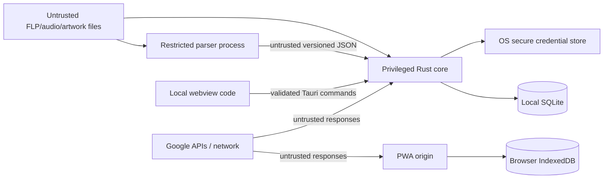

# Security and privacy

Status: **Active threat model; Phase 1 controls are implemented incrementally**

Fruitboard processes untrusted binary files while holding access to valuable
creative work. Its primary safety property is that analysis cannot modify,
execute, or upload those files.

## Assets to protect

- original FLP files, samples, and audio exports;
- user-authored notes, journal, tasks, ratings, releases, and work history;
- local database and backups;
- filesystem paths and project/dependency names;
- Google OAuth tokens and synchronized metadata;
- code-signing/update keys and release artifacts;
- availability of the UI, scanner, and project library.

## Trust boundaries

The webview is less trusted than Rust because a rendering or content-injection
bug must not become general filesystem/process access. The parser is less
trusted than Rust because it handles reverse-engineered binary formats. Drive
and all embedded metadata are untrusted inputs even after OAuth succeeds.

## Threats and controls

### Accidental FLP mutation or loss

- Parser API exposes only read operations and opens FLPs read-only.
- No PyFLP save/mutate API is reachable from application commands.
- Metadata edits write only the application database.
- “Open in FL Studio” and “open folder” are explicit OS actions; no rename/move
  API is included before its dedicated reviewed phase.
- A missing file is a reversible database state, never a delete request.
- Future file rename requires preview, explicit confirmation, same-directory
  atomic rename where supported, collision checks, and failure recovery. It
  never edits references inside an FLP.

### Malformed FLP or parser compromise

- Run parsing outside the UI and Rust process through a supervised sidecar.
- Enforce time, response-size, string-length, nesting/count, and memory-growth
  limits; terminate/restart on breach.
- Validate protocol/schema and numeric finiteness before persistence.
- Never execute scripts, plugin state, sample content, or paths from parser data.
- Do not load VST/native plugin DLLs to determine availability.
- Preserve the last good snapshot when a reparse fails.
- Fuzz the protocol/parser wrapper and retain non-sensitive crash fixtures.
- Explore Windows Job Object restrictions in the packaging PoC. Do not claim a
  complete sandbox merely because the parser is a process.

### Path traversal, symlinks, and unintended access

- Users grant roots through a native picker; Rust stores canonical device-local
  roots and validates every requested path against the active root at use time.
- Treat symlinks/reparse points explicitly. Default to not following directory
  links outside a selected root; track visited filesystem IDs to prevent cycles.
- Reject parent traversal, alternate data streams, device namespace paths, and
  NUL/control characters at boundaries where applicable.
- Pass paths directly to OS/process APIs, never concatenate a shell command.
- Revalidate file identity/fingerprint after open to reduce rename races.
- Do not expose a general “read file” Tauri command to JavaScript.

### Renderer injection or privilege escalation

- Ship only bundled local application content in the Tauri webview.
- Use a restrictive Content Security Policy with no `unsafe-eval`, no remote
  scripts, and explicit network destinations only when sync is enabled.
- Give the main window the minimum Tauri capabilities. No raw filesystem, raw
  SQL, generic shell, or arbitrary sidecar spawn permission reaches JavaScript.
- Rust commands validate authorization scope, IDs, paths, lengths, enums, and
  state transitions; TypeScript validation is convenience, not the trust gate.
- Render FLP comments, notes, filenames, Drive error text, and plugin names as
  text. If structured notes allow markup, sanitize against an allowlist and keep
  the source format versioned.
- Disallow untrusted navigation/new windows. Send reviewed HTTPS links to the
  system browser through a fixed allowlist policy.

Tauri capabilities reduce the impact of frontend compromise but do not protect
against unsafe Rust or overly broad scopes, so command review remains required.

The Issue #12 shell applies this baseline concretely. `apps/client` loads no
remote assets, the global Tauri object is disabled, prototype freezing and a
restrictive production CSP are enabled, and the capability is limited to the
local window. Issue #14 makes `get_app_health` require exactly
`{ schemaVersion: 1 }` and return a versioned success-or-error envelope with a
native correlation ID. Issue #16 adds separate permissions for reading and
writing one closed startup-view enum. Boundary tests fail if remote authority
or filesystem, shell, process, SQL, or opener permissions enter that capability.
New commands must add a specific permission and matching contract tests; broad
default permission sets are not accepted implicitly.

Issue #18's `packaging-smoke` feature registers the pinned Tauri shell plugin
only in the dedicated smoke artifact. Rust selects one configured inert binary
and three fixed modes; JavaScript receives no shell/process capability. The
probe echoes no supplied path, its failure text is fixed, timeouts are bounded,
and terminated children are reaped. This demonstrates lifecycle containment,
not a parser sandbox or permission to package Python/PyFLP.

Issue #34 adds four scan-root permissions (list, add, remove, pick) plus the
pinned dialog plugin registered in Rust only. Issue #35 adds two settings
permissions (rename, enable/disable) under the same typed-command boundary.
The renderer never invokes plugin dialogs directly: folder selection passes through the typed
`pick_scan_root` command, cancellation yields a null selection without
mutation, and picked paths are canonicalized, validated, and redacted from
diagnostics natively. Scan-root removal deletes configuration rows only and
never touches source files.

Malformed command input is rejected before use-case work and is never copied to
logs. Native operations run inside the command panic boundary, while unknown
failures become the fixed `internal` response. The renderer accepts only the six
known error codes with their exact message and retry policy; malformed or future
envelopes also fail closed as `internal`. Diagnostic text remains native-only.
The React root suppresses default callbacks that would print untrusted `Error`
objects, and the application error boundary replaces a failed render with a
fixed restart message. The native panic hook and startup failure path likewise
print only fixed safe text.

### Audio and artwork decoding

- Accept a small allowlist initially: WAV/MP3/FLAC for audio and decoded
  JPEG/PNG/WebP for artwork after content sniffing.
- Apply file-size, pixel-count, duration/metadata, and decompression limits.
- Do not display arbitrary SVG/HTML as artwork; convert or reject it.
- Use a scoped Tauri asset/stream protocol tied to known database asset IDs,
  never a general `file://` path from UI input.
- Browser/OS decoders are still attack surfaces; keep runtimes patched and
  include malformed media in security tests.

### SQLite and local data integrity

- Keep the DB in the app-data directory, outside sync/scanned roots.
- Rust is the sole writer; parameterize queries and validate advanced search to
  a query AST.
- Enable foreign keys, short transactions, busy timeout, tested migrations,
  pre-migration backups, and restore checks.
- Verify the embedded SQLite contains the March 2026 WAL-reset fix (3.51.3+ or
  an official fixed backport) before multi-connection WAL operation.
- Never ordinary-copy a live WAL database as backup.
- Provide export/backup without embedding OAuth tokens or logs.

### OAuth and Drive sync

- Local use requires no login. Ask for Google authorization only on “Enable
  sync,” using `drive.appdata` and no broad Drive scope.
- Desktop uses system-browser authorization code + PKCE, random state, and a
  temporary loopback listener. Bind loopback only.
- Store refresh tokens in Windows Credential Manager/macOS Keychain through a
  platform abstraction; keep access tokens in memory where practical.
- PWA tokens are not stored in IndexedDB, Cache Storage, URLs, analytics, or
  logs. Browser authorization may need to be repeated after expiry.
- Validate Drive file schema, compressed/uncompressed sizes, operation IDs,
  checksums, and protocol versions. Reject zip/gzip bombs and unknown required
  versions.
- Sync allowlisted projections only. Absolute paths, FLPs, raw exports, parser
  traces, and secrets are excluded.
- Disconnect revokes/removes credentials without destroying the local library.

### Supply chain and releases

- Commit lockfiles for pnpm, Cargo, and the parser; every GitHub Action reference
  uses a reviewed immutable commit SHA.
- Pull-request CI runs a repository privacy gate, high-severity `pnpm audit`,
  and RustSec advisory scanning. Dependabot proposes weekly pnpm, Cargo, and
  GitHub Actions updates for review.
- RustSec fails on every new vulnerability, unsoundness, unmaintained crate, or
  yanked crate. The reviewed exception list contains only Tauri's off-target
  Linux GTK3/WebKit graph and unmaintained Unicode helpers reached through
  Tauri's `urlpattern`; reassess it on every Tauri update and before Linux
  support.
- The CI token is read-only, checkout does not retain credentials, untrusted PR
  code receives no release secrets, and foundation jobs upload no artifacts.
- The separate Windows packaging smoke is also read-only and secret-free. It
  creates an explicitly unsigned installer only on its ephemeral worker, uploads
  nothing, and verifies `NotSigned` rather than implying trust. Public builds
  must sign the application, every sidecar, installer, and update metadata in a
  protected release environment with timestamping and post-build verification.
- GitHub dependency review, CodeQL, and GitHub secret protection were
  unavailable on the private GitHub Free plan when this control was recorded.
  The repository became public on 2026-09-07, so they are now available on the
  current plan; enabling them is part of the [pending branch-protection
  proposal](DEVELOPMENT.md#proposed-enforced-branch-protection-pending-owner-approval)
  and has not happened yet. Until enabled, the executable privacy regressions,
  `pnpm audit`, and RustSec checks below remain the baseline; never represent an
  unavailable or skipped integration as a passing security check.
- Add Python dependency auditing with the parser environment; the current empty
  research lock has no parser dependency and PyFLP remains blocked.
- Generate an SBOM for installers including the Python sidecar.
- Build sidecars and installers in controlled CI; sign Windows artifacts and
  future macOS artifacts. Keep signing credentials in protected environments.
- Tauri update manifests must be signed; updates fail closed on invalid
  signatures. Release publishing is tag/manual-only, never from pull-request
  code with signing secrets.
- Resolve PyFLP GPL-3.0 obligations before distribution. See
  [FLP_PARSER.md](FLP_PARSER.md#licensing-gate-p0-c).

### Denial of service and resource exhaustion

- Bounded scanner/parser queues with cancellation and backpressure.
- Coalesce watcher events; enumerate and parse in batches; cap retries.
- Validate counts before allocating arrays from parser/sync input.
- Paginate database/UI results and bound cached artwork/audio.
- Quarantine a repeatedly failing file without blocking the root.
- Drive sync uses backoff/jitter and bounded batch sizes.

## Privacy defaults

| Data/action | Default |
| --- | --- |
| Telemetry/product analytics | Disabled and absent |
| Crash reporting | Absent; any future service must be explicit opt-in |
| Local project metadata | Stored only on device |
| Google Drive metadata sync | Off until explicitly connected |
| FLP upload | Never part of metadata sync |
| Original audio upload | Never automatic |
| Optimized artwork/mobile preview | Explicit future opt-in |
| Absolute filesystem paths | Device-local and redacted from logs/sync |
| Logs | Local, bounded retention, path-redacted by default |
| Personal FLP/audio test fixtures | Ignored by Git; explicit review required |

The app should provide a readable “What syncs” view before Drive is enabled and
a local data export/delete workflow before sync is called stable.

## Logging policy

### Native storage boundary

Issue #15 opens SQLite only in the native-resolved local application-data
directory. Connections, SQL, backup paths, and recovery targets do not cross
IPC. File operations use fixed owned names, exclusive creation for backup and
recovery staging files, and a process-lifetime owner lock. Existing symlinks,
Windows reparse points, parent traversal, and Windows UNC/device paths are
refused. Unix files use mode 0600 and storage directories 0700. On Windows,
files inherit the current user's local application-data ACL; the app does not
grant additional access. Custom ACL editing and defense against hostile
processes running as the same user are not implemented.

Backups have the same privacy classification as the database. Source databases
and backups are retained during recovery. Under the owner lock, recovery
refuses destinations containing the database or any rollback-journal, WAL,
or SHM companion before staging. Empty companions also block recovery, and
all pre-existing files are preserved.
Database companions, backups, and staged recovery files are ignored by Git.
`StorageError` exposes a closed set of fixed codes and discards underlying
SQLite/io error strings, including their SQL, values, and paths. These codes
are the only storage diagnostics emitted during native startup.

The startup-view commands expose only the closed route enum, never a row key,
database path, SQL statement, or storage error. Unknown storage failures become
the fixed `internal` user response and `storage_failed` diagnostic; contention
becomes the fixed `unavailable` response and `storage_busy` diagnostic. Invalid
or extra request fields are rejected before repository work, and tests prove
that malformed values do not mutate the saved setting.

### Operational logs

Issue #14 writes newline-delimited JSON to `fruitboard.log` in Tauri's app log
directory. Each record is an allowlist of timestamp, level, subsystem, app
version, event, operation, correlation ID, and optional job ID, error code, and
diagnostic. There is no request, response, path, or binary-payload field. Command
errors select a fixed diagnostic code and discard unknown source text. Any
future diagnostic context must first enter the `SafeDiagnostic` value type,
which redacts OAuth tokens/codes/state/PKCE material, bearer credentials,
Windows/Unix/request paths, and relative FLP paths at construction. Because
paths can contain spaces and punctuation, any path signal replaces the complete
diagnostic with `[REDACTED_PATH]`; no path fragment is preserved. Control
characters or invalid-text replacement markers similarly replace the whole
value with a binary-payload marker, and the final diagnostic is at most 512
Unicode characters.

The default retention limit is 1 MiB per file, five files total including the
active file, and 14 days. Rotation and pruning run during writes. If the app log
directory cannot be resolved or initialized, logging disables itself rather
than failing a command or the shell. The active file's first record preserves
its original start timestamp across app restarts, so appending cannot refresh
its age. These logs omit:

- access/refresh tokens and authorization codes;
- absolute paths, usernames, Drive file names, project notes/comments;
- raw parser payloads and plugin state;
- full sync bodies and HTTP authorization headers.

Issue #14 adds no log-export command and no telemetry or crash-reporting
service. Any future diagnostic export must default to the already-redacted log,
show a preview, and require confirmation. Including a separately selected path
would require an explicit per-export choice; existing redactions are never
reversed. Human activity history is a different data set and must not ingest
debug noise.

## PWA origin controls

- Serve only over HTTPS with HSTS after deployment validation.
- Set CSP, `frame-ancestors`, `Referrer-Policy`, `X-Content-Type-Options`, and a
  restrictive `Permissions-Policy` at the static host.
- Do not place confidential secrets in the bundle; a web OAuth client ID is
  public configuration.
- Service worker caches only expected same-origin versioned assets. It does not
  cache OAuth callbacks/tokens or arbitrary Drive API responses.
- Protect against stale shell/schema combinations with a compatible protocol
  range and explicit update/reload path.

## Security verification plan

- Unit/property tests for path containment, symlinks, query parsing, schema
  limits, redaction, operation idempotency, and conflict handling.
- Parser fuzzing and malformed/corrupt/oversized fixtures with timeout checks.
- Integration tests prove read-only file handles and unchanged FLP hashes before
  and after scan/parse/open flows.
- Tauri capability snapshot review: every command/permission maps to a user flow.
- UI tests for injection strings in every extracted/user-authored surface.
- OAuth tests for state mismatch, loopback interception, revocation, expiry, and
  missing secure-store credentials.
- Sync tests for replay, corrupt batches, decompression limits, clock skew,
  conflict preservation, and remote deletion.
- Dependency/license/SBOM checks in CI; release artifact signature verification.

## Security review gates

1. Phase 1: capability/CSP baseline, SQLite version, logging/redaction, migration
   backup design, unsigned package/sidecar lifecycle and uninstall preservation.
2. Phase 2: scanner path/symlink threat model and non-destructive hash test.
3. Phase 3: parser sandbox limits, fixture/fuzz corpus, GPL decision.
4. Phase 6/7: OS open actions and media stream/decode review.
5. Phase 11: OAuth, sync protocol, conflict, encryption, deletion/recovery, and
   penetration review.
6. Phase 12: PWA headers, service worker/cache, IndexedDB migration, and real
   iPhone authorization/offline tests.

## Vulnerability handling

Before public distribution, add a private reporting channel and supported
version policy. A security fix receives a focused branch/PR, regression test,
coordinated signed release, and clear user impact. Never ask reporters to upload
private FLPs publicly; provide a local minimization/reproduction process.

## References

- [Tauri capabilities and security boundaries](https://v2.tauri.app/security/capabilities/)
- [Tauri runtime authority](https://v2.tauri.app/security/runtime-authority/)
- [Electron security comparison reference](https://www.electronjs.org/docs/latest/tutorial/security)
- [Google OAuth installed apps and PKCE](https://developers.google.com/identity/protocols/oauth2/native-app)
- [Google Drive app-data scope](https://developers.google.com/workspace/drive/api/guides/api-specific-auth)
- [SQLite WAL safety notes](https://www.sqlite.org/wal.html)
