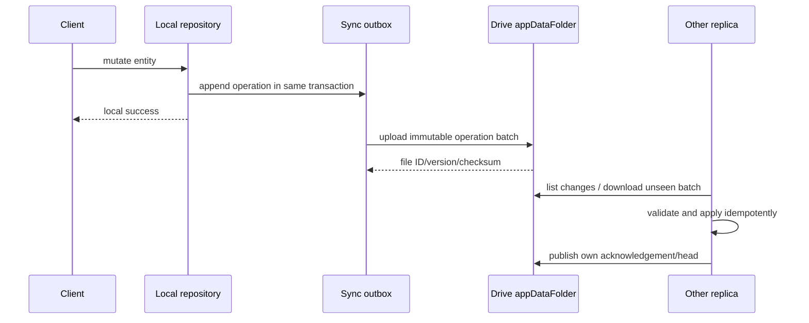
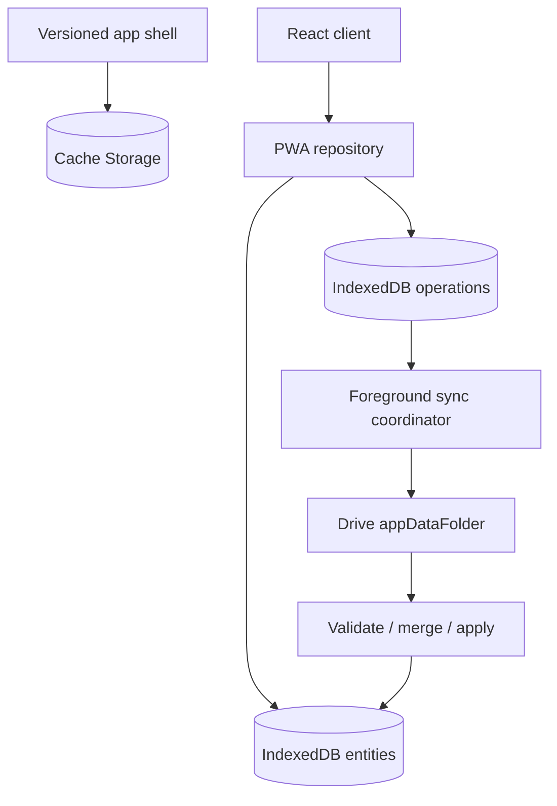

# Synchronization architecture

Status: **Proposed design for later Phase 11/12 implementation**

No sync code or Google Cloud credentials are created in Phase 0. Local desktop
functionality remains complete without authorization or a network.

## Scope and invariants

Google Drive synchronizes application metadata, not the SQLite file and not FLP
project files. The first backend is Drive, but the domain depends on a generic
`SyncBackend` and versioned operation format.

Invariants:

- Connecting Google is an explicit opt-in action.
- Only the non-sensitive `drive.appdata` scope is requested initially.
- The desktop and PWA each keep a local database/replica and durable outbox.
- A local mutation succeeds locally before network upload is attempted.
- Remote operations are authenticated, schema-validated, size-limited,
  checksum-verified, and applied idempotently.
- Absolute local paths, scan roots, logs, tokens, FLPs, and master exports are
  excluded from the default sync projection.
- Sync failure never prevents local desktop use.

The product owner has confirmed both path exclusion and foreground-only PWA
sync as Phase 0 decisions. Work sessions and meaningful activity events are
included after the user enables Drive sync so history and analytics agree
across replicas; raw process/window observations and low-level tracking
evidence stay device-local. Phase 11 must show this category in the pre-sync
preview and revisit encryption and a possible granular opt-out before release.

Google documents `appDataFolder` as a hidden per-application area, accessible
only to that app through the narrow `drive.appdata` scope. Users can delete the
data or remove the app, and items there cannot be shared or moved to ordinary
Drive space. These are accepted characteristics for a single-user personal
sync backend, not a collaboration backend.

## Why not sync SQLite

SQLite WAL uses a database plus companion WAL/shared-memory state and assumes
same-host coordination. File-sync tools are not transactional database
replication. Uploading the DB would create corruption/lost-update risks, leak
device-local paths, and prevent typed conflict handling.

Instead, both local stores project domain changes into a backend-neutral,
append-only operation log.

## Data flow



## Remote layout

Use opaque, flat names in `appDataFolder`; do not depend on user-visible folders:

```text
fruitboard-protocol-v1.json
device-<device-id>.json
ops-v1-<device-id>-<first-seq>-<last-seq>-<hash>.json.gz
snapshot-v1-<snapshot-id>-<hash>.json.gz        # later compaction/bootstrap
snapshot-head-v1.json                           # optimistic pointer
asset-v1-<asset-id>-<hash>.<ext>                # opt-in optimized artwork/preview
```

An installation writes only operation files for its own random device ID.
Operation batches are immutable after upload. This avoids two devices
overwriting one journal file. A small per-device descriptor advertises protocol
versions and last sequence; correctness does not depend on it being perfectly
current because files can be listed.

Each compressed batch contains:

- protocol/schema version and originating installation ID;
- a contiguous origin sequence range;
- creation HLC and previous batch hash for diagnostics;
- operations with globally unique IDs, entity/field IDs, base revision/hash,
  tombstone where applicable, and payload;
- checksum of canonical uncompressed content.

Upload to a new Drive file, verify its metadata/checksum, then mark local
operations uploaded. Retrying the same batch is harmless: content/name and
operation IDs deduplicate it.

Use Drive `changes.getStartPageToken`/`changes.list` after initial discovery to
avoid listing everything on every sync. Tokens and Drive file versions/ETags
are hints/cursors; missing/invalid tokens fall back to a complete
`appDataFolder` manifest/list reconciliation.

### Snapshots and retention

Start without destructive compaction until scale requires it. Later, any device
may write an immutable snapshot containing resolved state plus per-device
operation watermarks, then update `snapshot-head-v1.json` with optimistic
concurrency. Concurrent snapshots are harmless; the losing pointer update is
discarded or retried.

Do not delete operation batches until every non-retired known device has
acknowledged a snapshot watermark. Device retirement is an explicit action with
a long safety window. Drive app-data files cannot be trashed; cleanup is a
permanent delete and therefore requires conservative, tested policy.

## Operation and conflict model

Use a Hybrid Logical Clock (HLC) plus origin device/sequence for deterministic
ordering without trusting wall clocks. HLC does not make every conflict safe to
auto-resolve; it only supplies ordering metadata.

| Data shape | Merge rule |
| --- | --- |
| Rating, priority, progress, favorite, stage, simple scalar metadata | Per-field later HLC wins; keep prior revision in history for recovery |
| Tags and set memberships | Add-wins observed-remove set using membership operation IDs |
| Tasks, journal entries, release tracks | Independent stable entities; concurrent additions coexist |
| Task fields/completion | Per-field merge; delete/edit races retained as a visible conflict when ambiguous |
| Main structured note | Three-way merge only when base revision is known; otherwise preserve both as conflict copies |
| Journal/task body edited concurrently | Preserve both versions and ask user to choose/merge |
| Ordered lists/stages/tracks/tasks | Lexicographic fractional rank keys with deterministic tie break; compact ranks via explicit operation |
| Deletion | Tombstone ordered against edits; never silently discard an edit that did not observe the deletion |
| Derived parser data | Immutable snapshot keyed by input/parser/schema; newer does not erase incompatible older diagnostics |
| Version/export suggestions | Recomputable; sync confirmed/rejected decisions, not every local candidate |

“Last write wins” is therefore limited to low-risk independent scalar fields,
and even there recent history makes accidental overwrites recoverable. Notes and
delete/edit races never silently choose one body.

The merge engine is a shared, deterministic TypeScript package with the same
conformance vectors used by desktop and PWA. Desktop Rust validates operations
and owns persistence; it may call an equivalent Rust implementation generated
from the same fixtures or use a narrowly packaged merge library after Phase 11
design review. Cross-runtime golden tests are mandatory.

## Desktop authorization

Use Google's installed-application authorization code flow with PKCE and the
system browser. For Windows/macOS desktop, Google recommends a loopback IP
redirect on a random local port. Validate `state`, bind only to loopback, close
the listener promptly, and never place tokens in URLs or logs.

Store refresh tokens in platform secure storage (Windows Credential Manager;
later macOS Keychain) behind `SecureSecretStore`. Keep access tokens in memory
where practical. Disconnect revokes credentials when possible and deletes local
secure-store entries; it does not delete local product data.

OAuth desktop clients are public clients: an embedded client identifier is not
a secret. Any truly confidential secret must not be shipped in the app.

## PWA authorization limitation

Use Google Identity Services for browser authorization. Google's browser token
model returns short-lived access tokens and removed automatic refresh; after
expiry the app must request a new token. A browser-only PWA has no secure place
for a long-lived client secret or refresh token and there is intentionally no
Fruitboard account/backend in the initial design.

Therefore:

- sync runs on app open, foreground/network recovery, explicit refresh, and
  opportunistically while the page is active;
- offline mutations remain in IndexedDB until authorization and connectivity
  are available;
- the UI may ask the user to reconnect/continue with Google after token expiry;
- do not promise silent, continuous iOS background sync;
- no OAuth token enters IndexedDB, Cache Storage, logs, or operation payloads.

If truly unattended background mobile sync becomes a requirement, that is a
new architecture decision likely involving a minimal trusted backend or native
application. It is not inferred from the current scope.

## PWA offline architecture



- The service worker precaches hashed application assets and an offline entry;
  updates are downloaded safely and activated through an explicit/recoverable
  update flow.
- IndexedDB stores normalized syncable entities, applied operation IDs,
  conflicts, cursors, and the durable outbox in transactions.
- Sensitive Drive API responses use network handling and IndexedDB projection,
  not general Cache API storage.
- A mutation is shown as saved only after its IndexedDB transaction commits.
- Request persistent browser storage where supported, but design for eviction:
  Drive can rebuild synchronized state; clearly warn about unsynced local-only
  changes when storage pressure or logout is detected.
- Connectivity events trigger attempts, not state assumptions. A successful API
  exchange determines online status.
- Shell/schema upgrades run ordered IndexedDB migrations with rollback/recovery
  tests and refuse incompatible future protocols safely.
- Audio/artwork caches use separate bounded policies and never evict metadata
  outbox state intentionally.

Use iOS 17+ as the initial PWA baseline. This decision remains subject to P0-H,
which must test installed Home Screen behavior, IndexedDB/storage persistence,
OAuth popups/redirects, token expiry, service-worker updates, audio, and offline
edits on real iPhones. Amend the baseline rather than weakening required flows
silently if real-device evidence fails.

## Bootstrap and recovery

1. A new replica authorizes and lists `appDataFolder`.
2. It validates the protocol marker and refuses unknown incompatible major
   versions without modifying remote data.
3. It downloads the latest valid snapshot when present, then every operation
   after each snapshot watermark; without a snapshot it replays all batches.
4. It applies operations in deterministic order and records operation IDs.
5. It uploads its device descriptor and any local outbox only after bootstrap.

Corrupt/missing batches are quarantined locally and reported. Never advance a
cursor past an unhandled required operation. Retry transient HTTP failures with
jitter and respect quota/backoff responses. A local export of metadata and a
remote rebuild procedure must exist before calling sync stable.

## Data volume policy

- Metadata operations are small and batched by count and compressed size.
- Parser detail is projected to user-visible/searchable summaries; raw FLP
  binary data and parser tracebacks are excluded.
- Absolute sample paths are excluded; safe basename/type and optional relative
  hint can sync.
- Artwork sync uses an explicitly selected, resized derivative with byte and
  dimension limits.
- Mobile audio preview sync is a later opt-in derivative; never upload WAV/FLAC
  masters automatically.

## Encryption analysis

HTTPS protects data in transit and Google protects Drive storage under the
account, but app metadata is readable to an authorized Fruitboard client.
Optional end-to-end encryption would protect app-data content from the storage
provider but introduces passphrase recovery, multi-device key bootstrap,
search/index limitations, and irrecoverable-loss risks.

Phase 11 must make a product decision:

- baseline: provider encryption + narrow scope + minimized payloads; or
- optional client-side envelope encryption using a user-held recovery secret,
  versioned AEAD, per-asset keys, and authenticated headers.

Do not invent a hidden embedded encryption key. If client-side encryption is
selected, threat-model and recovery UX receive their own ADR and security review.

## Open questions / PoCs

- Confirm that desktop and web OAuth clients in the same Google Cloud project
  observe the same app-data namespace for the intended account.
- Verify Drive change-token behavior and query filtering for `appDataFolder`.
- Measure listing/replay with 10k/100k synthetic operations and snapshot size.
- Exercise simultaneous offline edits, token revocation, quota/rate limiting,
  duplicate batches, corrupt gzip/JSON, clock skew, device reinstall, storage
  eviction, and Drive data deletion.
- Confirm Google OAuth verification/publishing requirements before release.
- Decide conflict retention and retired-device/tombstone expiration windows from
  measured data volume.

## References

- [Store application-specific data in Drive](https://developers.google.com/workspace/drive/api/guides/appdata)
- [Choose Drive API scopes](https://developers.google.com/workspace/drive/api/guides/api-specific-auth)
- [Retrieve Drive changes](https://developers.google.com/workspace/drive/api/guides/manage-changes)
- [OAuth for desktop applications](https://developers.google.com/identity/protocols/oauth2/native-app)
- [Google Identity Services web authorization](https://developers.google.com/identity/oauth2/web/guides/overview)
- [WebKit storage policy](https://webkit.org/blog/14403/updates-to-storage-policy/)
- [WebKit service worker lifecycle notes](https://webkit.org/blog/8090/workers-at-your-service/)
