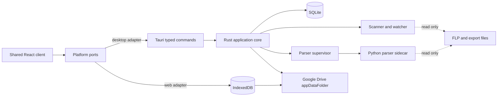

# Phase 0 review brief

Status: **Conditionally accepted — documentation corrections complete; GitHub
branch protection remains blocked**

Date: 2026-09-04

No production application code exists in this phase. This brief is the review
gate for Phase 1.

GitHub review is organized under epic #1 as stacked PRs #6, #7, #8, and #9, in
that order. Keep the intermediate branches until the full stack has merged.

## Executive recommendation

Build Fruitboard as a Tauri 2 desktop application with a React 19 + TypeScript
client. Keep filesystem access, scanning, SQLite writes, parser supervision, and
operating-system actions behind the Rust boundary. Build the PWA from the same
client and shared domain packages, substituting browser storage and sync
adapters for desktop commands.

Use a versioned, read-only FLP parser protocol rather than exposing PyFLP types
to the application. The leading implementation is a packaged Python sidecar,
but that choice is conditional on two gates:

1. a representative FL Studio compatibility and packaging proof-of-concept;
2. an explicit GPL-3.0 distribution/licensing decision.

SQLite is the authoritative local desktop store. Optional Google Drive sync
uses the hidden `appDataFolder` and an idempotent operation log; the database
file itself is never synchronized. The PWA keeps its own IndexedDB replica and
synchronizes while foregrounded. It does not scan files.

## System shape

Full rationale and boundaries are in [ARCHITECTURE.md](../ARCHITECTURE.md).

## Decisions accepted in review

| Area | Recommendation | Status |
| --- | --- | --- |
| Desktop | Tauri 2, local bundled UI, narrow capabilities | Accepted |
| Frontend | React 19, strict TypeScript, Vite, React Aria Components, vanilla CSS tokens | Accepted |
| Desktop data | SQLite owned by the Rust application layer | Accepted |
| IDs | UUIDv7 stable IDs; paths are locators, never identity | Accepted |
| Scanner | Native watcher as an invalidation signal plus reconciliation | Accepted |
| Parser | Versioned JSON-lines boundary accepted; PyFLP dependency/distribution blocked | Conditional |
| PWA | Same client/domain packages; IndexedDB replica and service worker; iOS 17+ baseline subject to P0-H | Accepted |
| Sync | Optional Drive `appDataFolder`, immutable per-device change batches, foreground PWA sync | Accepted |
| Privacy | No login for local use, no telemetry, no FLP upload, paths excluded from sync by default | Accepted |
| Delivery | Small PRs, protected `main`, required CI and review checkpoints | Blocked on repository protection entitlement |

The corresponding records are in [docs/adr](adr/README.md).

## Material findings

### PyFLP is promising but not yet a safe commitment

PyFLP documents high-level access to projects, arrangements, playlist tracks,
channels, patterns, mixer inserts, plugins, and VST2/VST3 data. Its current
stable PyPI package is `2.2.1`, published in June 2023, marked Alpha, and
GPL-3.0. An open upstream issue reports changed playlist data in FL Studio 2025
projects. These facts require a compatibility matrix rather than an assumption.

A local research-only probe used upstream commit
`f937126b888ce94271bfea631b89166c74056530` and its public test fixtures:

| Input | Observed result |
| --- | --- |
| `FL 20.8.4.flp`, 190,128 bytes | Parsed in approximately 239 ms on this development machine |
| Project fields | FL 20.8.4.2576, 69.42 BPM, 4/4, title/comments/author |
| Structure | 5 patterns, 19 channels, 2 arrangements, 127 mixer inserts |
| Plugins | Native plugin classes plus VST names including Sylenth1 and OTT |
| Timeline | First arrangement had 22 clips and a maximum raw end of 1536 ticks at PPQ 96 |
| Six corrupt upstream fixtures | Each returned a typed `HeaderCorrupted` failure in under 1 ms |

The fixture returned an embedded `time_spent` of 9,119.258001 seconds while the
upstream test contains a disabled expectation for a different value. This is
one concrete reason not to equate that field with reliable work history.

This experiment is directional only: one old, parser-authored fixture is not a
representative corpus. See [FLP_PARSER.md](../FLP_PARSER.md).

### Google Drive is viable, with an important PWA constraint

Drive's `appDataFolder` is hidden, app-specific, and accessible through the
narrow non-sensitive `drive.appdata` scope. It is appropriate for metadata but
not a live database. It cannot be shared and users can delete it or remove the
app. The browser flow supplies short-lived access tokens and no longer refreshes
them automatically. Consequently, a backend-free PWA can sync reliably when it
is foregrounded and authorized, but continuous background sync must not be
promised.

### Filesystem watches cannot be the source of truth

Windows change-notification buffers can overflow, and virtual/network-backed
folders may omit or delay events. Google Drive streamed files can also trigger
downloads when accessed. Watch events therefore enqueue targeted checks; a
successful reconciliation is what establishes presence or absence. Offline
roots never mark their projects deleted.

### SQLite version is a release gate

SQLite disclosed a rare WAL-reset corruption bug fixed in 3.51.3 (and selected
backports). Phase 1 must verify that the Rust SQLite binding embeds a fixed
version before enabling multi-connection WAL use.

## Assumptions

- The first supported desktop baseline is 64-bit Windows 10/11.
- FL Studio files are usually local or exposed through an ordinary/virtual
  Windows filesystem path; the app does not use Google Drive APIs to find FLPs.
- A single user may eventually use more than one desktop plus an iPhone PWA.
- The repository may become public; privacy controls therefore assume every
  commit can become public even though it is currently private.
- The final product license and commercial distribution model have not been
  chosen. GPL distribution is not accepted; the interim constraints are in
  [LICENSE_INTENT.md](../LICENSE_INTENT.md).
- Internet access is optional except for explicit Drive sync, dependency setup,
  and updates.
- English is the first UI language, but storage and layout must accept Unicode
  and later localization.

## Open uncertainties and required PoCs

| PoC | Question | Bounded output | Gate |
| --- | --- | --- | --- |
| P0-A parser matrix | What does PyFLP reliably expose across FL 12–current and feature combinations? | Python 3.11 candidate; sanitized FL 21/2024/2025/current corpus; normalized JSON, expected-field matrix, failures | Before parser implementation |
| P0-B parser packaging | Does a signed PyInstaller sidecar start, parse, update, and uninstall cleanly on supported Windows systems? | Python 3.11 candidate bundle, timings, AV/signing notes; no app feature | Before selecting sidecar packaging |
| P0-C licensing | Can the intended application distribution comply with PyFLP GPL-3.0? | Final owner/legal decision and repository license; interim intent is recorded | Before adding, shipping, linking, or bundling PyFLP |
| P0-D watcher/DriveFS | How do rename, burst-save, disconnect, stream placeholders, and root moves behave? | Event traces and reconciliation assertions | Before Scanner MVP watcher PR |
| P0-E file identity | Are Windows volume serial + file ID stable on NTFS and Drive mirrored/streamed roots? | Matrix and fallback policy | Before automatic move detection |
| P0-F duration | Which arrangement and tempo-automation events support a defensible estimate? | Fixture expectations and uncertainty rules | Before showing duration |
| P0-G Tauri package | Does Tauri + sidecar install/sign/update correctly and play target audio formats? | Disposable spike and size/startup metrics | Before foundation is called releasable |
| P0-H browser sync | Can an iPhone PWA authorize `drive.appdata`, recover after token expiry, and drain an IndexedDB outbox? | Device test notes | Before Phase 11/12 implementation |

PoCs must use generated, upstream-public, or explicitly approved sanitized FLPs.
Personal projects are never automatic fixtures.

## Review questions

The product owner answered these on 2026-09-04:

1. **GPL distribution: no.** Do not accept GPL distribution yet. Keep PyFLP
   blocked behind the parser interface and complete P0-A/P0-B/P0-G before any
   amended licensing decision. No PyFLP dependency is permitted in Phase 1.
2. **iOS 17+ baseline: yes, conditionally.** P0-H must validate the required
   installed-PWA, authorization, offline, storage, and recovery flows on real
   devices.
3. **Path sync: exclude by default.** Absolute and relative filesystem paths
   remain device-local unless a future privacy review defines a narrower safe
   projection.
4. **PWA sync: foreground-only is accepted.** Do not add a proprietary backend
   or promise silent background iOS synchronization.
5. **Identity split: accepted.** `Project`, `ProjectFile`, and device-local
   `FileLocation` remain separate.

## Unresolved repository-protection gate

On 2026-09-04, GitHub returned HTTP 403 for both the branch-protection and
repository-rulesets APIs for this private repository, requiring GitHub Pro or a
public repository. Repository visibility was not changed because making the
project public is a separate privacy/distribution decision.

The Phase 0 stack must remain unmerged until the private repository gains an
entitlement that supports protection. Then protect `main` with pull requests,
one approval, stale-approval dismissal, required checks, blocked force-push and
deletion, and linear history. No Phase 1 epic/issues should be created before
that gate is resolved and the checkpoint is finally accepted.

## Assignment coverage

| Requested output | Document |
| --- | --- |
| Overall architecture, repository, framework/frontend evaluation | [ARCHITECTURE.md](../ARCHITECTURE.md) |
| PyFLP design and experiments | [FLP_PARSER.md](../FLP_PARSER.md) |
| Scanner and watcher | [ARCHITECTURE.md](../ARCHITECTURE.md#scanner-architecture) |
| SQLite model | [DATA_MODEL.md](../DATA_MODEL.md) |
| Project identity, work time, export matching | [ARCHITECTURE.md](../ARCHITECTURE.md) |
| Drive and PWA synchronization | [SYNC.md](../SYNC.md) |
| Security and privacy | [SECURITY.md](../SECURITY.md) |
| Tests, tooling, CI, GitHub workflow | [DEVELOPMENT.md](../DEVELOPMENT.md) |
| Milestones and PR/issue structure | [ROADMAP.md](../ROADMAP.md) |
| Major decisions | [ADRs](adr/README.md) |

## Sources checked

Research was refreshed on 2026-09-04 from upstream or platform-owner sources,
including [Tauri 2 security and capabilities](https://v2.tauri.app/security/capabilities/),
[Tauri sidecars](https://v2.tauri.app/develop/sidecar/),
[Electron security](https://www.electronjs.org/docs/latest/tutorial/security),
[PyFLP on PyPI](https://pypi.org/project/pyflp/),
[PyFLP's project API](https://pyflp.readthedocs.io/en/latest/reference/project.html),
[Google Drive app data](https://developers.google.com/workspace/drive/api/guides/appdata),
[Google OAuth for installed apps](https://developers.google.com/identity/protocols/oauth2/native-app),
[Google web authorization](https://developers.google.com/identity/oauth2/web/guides/overview),
[Windows directory notifications](https://learn.microsoft.com/en-us/windows/win32/api/winbase/nf-winbase-readdirectorychangesw),
[Google Drive streaming/mirroring](https://support.google.com/drive/answer/13401938),
and [SQLite WAL](https://www.sqlite.org/wal.html).
