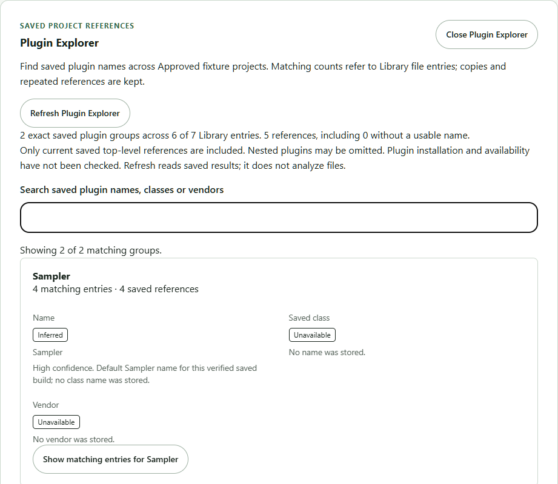
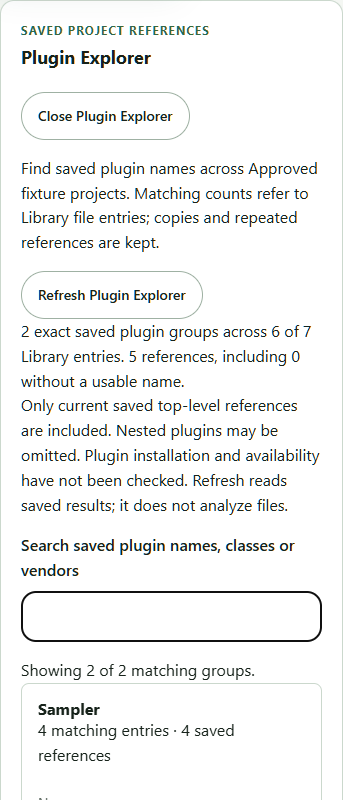
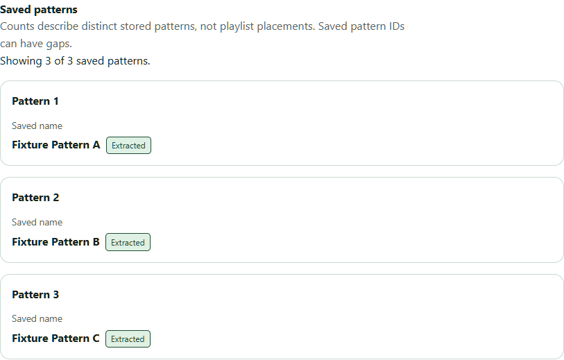
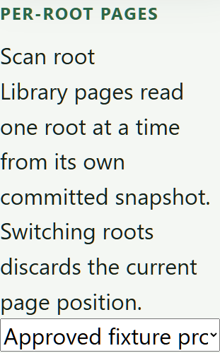
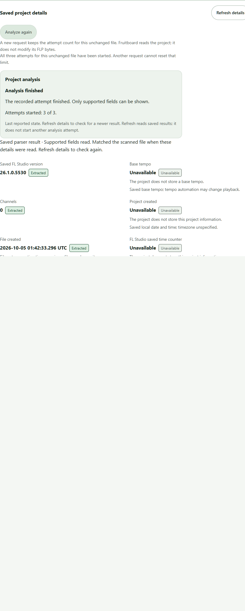

# Installed combined workflow and Library text reflow (#265)

**Result: the bounded current installed workflow passes, including a corrected
Library layout at enlarged text sizes.** The real Windows app scanned approved
projects, analyzed them, displayed saved patterns/details, and queried Plugin
Explorer. Results survived restart; missing sources, disabled/removed roots,
unavailable parser, and interrupted analysis retained their safety boundaries.
This is development-app evidence, not Phase 3 or resource-budget acceptance.

## Source and package boundary

The baseline is merged PR264, `48de3df2b1731a448c015325e2ac24f509593bc5`,
whose tree equals the reviewed `22f2440` head. The corrected installed build is
`e1e00c6dc824dcbd31ead5a8ef7518b1536c5539`; later commits add the regression
script and this report without changing its compiled application inputs.
Its parser, storage, native commands, dependencies and fixtures are unchanged.

An explicitly unsigned current-user NSIS package enabled `analysis-jobs` using
the retained review configuration. Product: `Fruitboard Combined Review 265
Fixed`; identifier: `com.fruitboard.desktop.combined-review-265-fixed-20261004`.
Its Local profile and install directory were initially absent. The baseline
also used a separate review identity. Neither run seeded, moved, replaced, or
opened the owner's Foundation Smoke or production profiles. Both used the
existing exclusive Foundation Smoke host lock and separate static review
configurations; no application data-directory override was added.

Build command: `pnpm --filter @fruitboard/desktop tauri build --features
analysis-jobs --config <retained review-package.config.json>`, after the locked
`prepare-foundation-sidecar.mjs` step. Installed parser SHA256:
`1B200ED070F1CFDFD47E448C20C71097F64D760119E2CB172B120376DD11E83A`.
Installed corrected desktop SHA256:
`1C8E1300230AF33D7604B464EDE56AC10814BF86092ECD5210B9C8E97A129956`.
Raw compiler/installer/installed hashes, configuration, source equivalence and
independent-copy receipts remain private. Tauri's NSIS bundle-type patch is
recorded separately from compiler output, as in the earlier installed review.

WebView2 `154.0.4258.53` loaded the real bundled client from
`http://tauri.localhost`. The owned loopback debugger attached to that renderer;
there was no browser adapter substitution. Root admission called the actual
native command with approved fixture folders; subsequent scan/refresh/retry,
Explorer search, root controls and navigation used the real UI. Folder-picker
dialog behavior remains covered by its existing separate Windows checks.

## Installed results

| Case                  | Verified result                                                                                                                                                                                                                                           |
| --------------------- | --------------------------------------------------------------------------------------------------------------------------------------------------------------------------------------------------------------------------------------------------------- |
| Fresh Library scan    | Seven renamed approved files published through authoritative scans; valid, partial, unsupported-field and invalid-file states stayed distinct.                                                                                                            |
| Saved patterns        | Approved F13 displayed three distinct stored patterns and all three names, independently of its four playlist placements. Older unverified builds remained unsupported for patterns.                                                                      |
| Plugin Explorer       | Complete groups/counts/matching entries agreed with current authorized details. Search, keyboard expansion and nested details worked; an unmatched search showed its empty state.                                                                         |
| Refresh               | Both details and Explorer refresh preserved saved snapshot identity, fields and analysis attempts; no analysis was requested.                                                                                                                             |
| Larger files          | Constructed 4,601,596- and 25,000,000-byte wrapper-state projects completed real supervised analysis and publication. Their saved Synthetic Plugin references produced one Explorer group with two matching entries. No analysis-size rejection occurred. |
| Restart               | Library locations, facts, patterns, references, snapshots and Explorer aggregates survived graceful close/reopen.                                                                                                                                         |
| Missing parser        | Holding only the owned installed sibling produced `parser_unavailable` and no current facts/references. The unchanged-file three-attempt limit persisted across restart; exhausted Retry remained disabled.                                               |
| Parser recovery       | Identical parser bytes were restored. A new modification-time observation of unchanged approved bytes permitted fresh analysis, which survived another restart.                                                                                           |
| Interrupted work      | The owned real parser was suspended while a durable job was running; only its verified parent app was terminated. Restart recovered the job, preserved facts/references, incremented the attempt correctly and persisted the new snapshot.                |
| Source/root authority | Old fingerprints were rejected. A missing source lost both details and Explorer matches; restoring it recovered current results. Disabled/removed roots returned unavailable Explorer results; another root's groups remained isolated.                   |
| Accessibility         | Populated installed Library/patterns/Explorer reported zero axe WCAG A/AA violations **and no incomplete rules** at 1280, 560 and 390 px. Keyboard Explorer refresh retained focus; reduced motion and 200% text were exercised.                          |

The larger files are constructed padding, not additional genuine FL Studio
compatibility fixtures. The seven genuine/malformed files are unchanged approved
corpus copies. All twelve source FLPs remained byte-identical, as did constructed
input bytes and protected personal profile files. Only owned copies' modification
times changed for explicit freshness cases. Raw paths, databases, logs and
process records stay outside Git.

## Layout defect and regression

At 390 px with a 32 px default font (200% text), the unbounded root selector's
intrinsic width expanded the Library grid to a **413 px document**. The fix sets
the selector section's minimum inline size to zero and constrains the select to
its available width. It does not hide overflow or shrink the owner's text.
The corrected document is **375 px** wide inside the 390 px viewport; the select
ends at 343 px. Native select text can still truncate while its full option list
is available through the standard keyboard/native picker behavior.

The committed [regression check](../../../scripts/check-installed-library-reflow.mjs)
asserts actual browser layout at 1280/390 px with 16/32 px text, requires at least
two roots, and restores debugger emulation. It rejected the independently retained
PR264 binary with the observed 413 px overflow and passed the corrected installed
binary. Run it only against the owned review app's loopback debug port:

```powershell
node scripts/check-installed-library-reflow.mjs http://127.0.0.1:<owned-port>
```

It reads layout and changes debugger emulation, without scanning, analyzing,
writing application data or changing the compiled CSP. WebView2 applies the
changed default font after reload; the test checks the actual computed font.
The regression therefore cannot silently claim enlarged-text coverage at 16 px.

Earlier setup failures are retained: an old helper expected a differently named
retained executable; an early failed/reused launch left a cancelled scan; clean
launch passed. Measurement helpers initially selected duplicate text rather than
the heading and compared serialized byte sizes as numbers without conversion.
Those orchestration corrections did not alter product behavior. Successful timed
stages were retained when continuing the final memory case.

## Whole installed-app characterization

Boundaries, sample counts and a 0.5 CPU-second background application/build/test
noise guard were declared before measurement. No other local build/test/app
workload ran during the windows. All four completed windows met the observed
guard; per-process CPU, power/machine context and sampling limitations remain
in the raw evidence. This remains **characterization**, because whole-app targets
have not been approved and the matrix is narrow.

The installed Library contained seven entries and two exact saved plugin groups.
Each latency case records a first request, one excluded warm-up and ten warm
samples. Nearest-rank p95 with ten samples is the maximum; all samples are in
[the sanitized results](results.json). OS caches were not flushed.

| Measured boundary                                                                                |     First |  Warm p95 |
| ------------------------------------------------------------------------------------------------ | --------: | --------: |
| Process creation to observed populated Library, including loopback debugger discovery/attachment | 695.91 ms | 718.59 ms |
| Renderer invoke through returned Explorer envelope, including native work, JSON and WebView IPC  |   4.20 ms |   4.70 ms |
| Explorer refresh activation to ready DOM plus the next animation frame                           |   9.30 ms |  12.60 ms |
| Pattern details refresh activation to ready DOM plus the next animation frame                    |  14.80 ms |  14.90 ms |

Installation, fixture generation/scans/initial analyses, screenshots and axe
audits are outside timing windows. Startup is a populated-profile launch with
warm OS caches, not a fresh-profile or cold-disk qualification. Debugger polling
adds observation overhead. UI timers include the render commit and next frame,
not a hardware display paint measurement. The native-only 2,000-entry matrix
from #259 is a different boundary; these small-library IPC timings do not
replace it or qualify Library scale/scanner performance.

Whole-app samples cover the desktop, parser when present, and descendant
WebView2 processes, using concurrent sums rather than added lifetime peaks.
The ten-second steady window recorded **375.88 MiB working set / 220.70 MiB
private commit** maxima. The separate 25 MB analysis window recorded
**414.60 / 248.08 MiB**. Working set sums can count shared pages more than once;
private commit is not physical RAM. Requested sampling was every 100 ms, with
process-tree enumeration every second; actual intervals and short-lived processes
limit peak/CPU coverage. The raw process inventory preserves included members.
The earlier proposed 128 MiB ceilings apply separately to native probe processes,
not the entire app plus browser engine. No whole-app ceiling is accepted here.

## Screenshots

These are native rendered views of approved/constructed fixture data. Raw views
containing private run paths remain private; no personal projects are published.







## Checks, storage and handoff

Pinned Windows `pnpm check` passed on the fix: 356 client tests plus the complete
default workspace tests/Clippy, format/lint/types/privacy/policy and production
build. The added regression script passed syntax/format checks and the actual
installed negative/positive controls. Unchanged native enabled behavior has
PR264's 15 successful checks and the new real installed results; final-head
PR checks remain required for this change.

Codex `/root` exclusively owns the existing reusable validation cache
`fruitboard-validation-cache/bounded-probes`; its absolute path is recorded in
the private handoff. One heavyweight build ran at a time. Explicit read-only
preflights budgeted 6 GiB additional output on C and preserved the 30 GiB reserve.
Retained installers/binaries are independently copied, hash-checked and outside
compiler caches. Audited internal Cargo hardlinks were separated by byte copies
inside only that cache. No compiler intermediates, source, dependencies,
toolchains, fixtures or historical evidence were deleted; the primary cache is
preserved. Final free space and final artifact/link receipts are in the handoff.

Both owned review registrations were uninstalled, with each database unchanged
by uninstall. Their synthetic profiles/databases and retained binaries/logs
remain evidence. No owned app/parser/helper or host lock remains. The owner
profiles were verified byte-identical and were never launched or replaced.

G4's bounded current installed workflow is now covered. Whole-app resource
boundary/target decisions, representative/limit-scale measurements, G1 budget
approval and the broader [gap ledger](../flp-intelligence-readiness/gap-ledger.md)
remain open. Next plan separately approved compatibility fixtures (G3); keep
sample dependency resolution, fuller MIDI/mixer/arrangement summaries, public
distribution and later phases within their separate gates.
