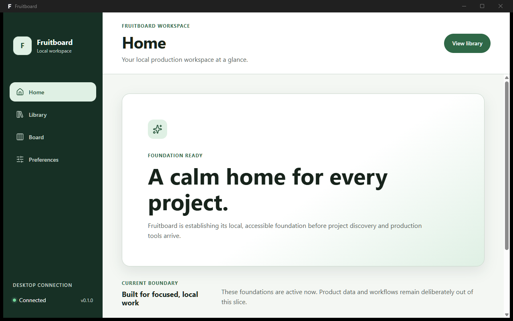
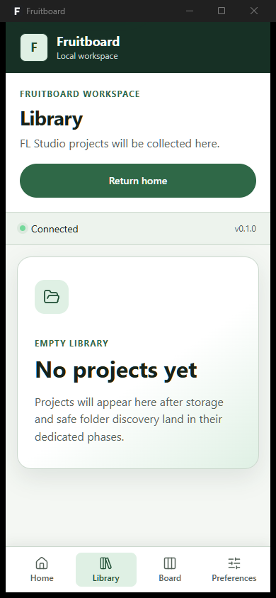

# Issue #13 shell visual and accessibility review

This review covers the low-fidelity Application Foundation shell only. It does
not claim real project, library, board, scanner, storage, or PWA behavior.

## Information hierarchy

The desktop layout presents, in order:

1. a skip link;
2. product identity and primary navigation;
3. the global desktop-connection region;
4. route title, description, and page action;
5. the main route content.

At narrow widths the same semantic navigation moves to a sticky bottom row with
48-pixel touch targets. Product identity, page context, global status, and main
content remain above it. No duplicate mobile navigation or mobile-only action is
rendered.

## Representative states

| State | Evidence |
| --- | --- |
| Initial | Home route foundation panel |
| Loading | Polite desktop-connection status while the platform port resolves |
| Empty | Library route with no project data |
| Error | Unknown-route panel and contained native-connection failure |

The global connection region intentionally exposes no raw native error details;
the stable command/error envelope belongs to Issue #14.

## Visual evidence

### Desktop — 1280 × 800 window

### Narrow touch layout — 390 × 844 window

## Accessibility evidence

- Keyboard tests put the skip link first, preserve logical navigation order,
  and move focus to `main` after a route change.
- The single navigation exposes the active route with `aria-current="page"`.
- Automated axe checks cover initial, loading, empty, route-error, and
  connection-error states. The jsdom-incompatible color-contrast rule is
  excluded there; policy tests independently require at least 4.5:1 for text
  token pairs and 3:1 for the focus indicator.
- Text and layout sizing use relative units, visible focus has a contrasting
  halo, forced-colors receives explicit borders, and reduced-motion removes the
  connection animation and transitions.

## Known limitations and deferrals

- Home, Library, Board, and Preferences contain foundation copy rather than
  real product data or controls.
- Dark mode is deferred, not rejected.
- The narrow layout has no service worker, installation prompt, offline cache,
  browser storage, scanner action, or separate PWA entry.
- The temporary non-Windows Vite fallback remains unchanged. Phase 12 chooses
  and tests the explicit PWA browser target before that entry ships.
- Native error envelopes and logging begin in Issue #14; SQLite begins in Issue
  #15; installer evidence remains Issue #18.
- Automated accessibility checks supplement rather than replace keyboard,
  screen-reader, zoom, contrast, and forced-colors manual review.
