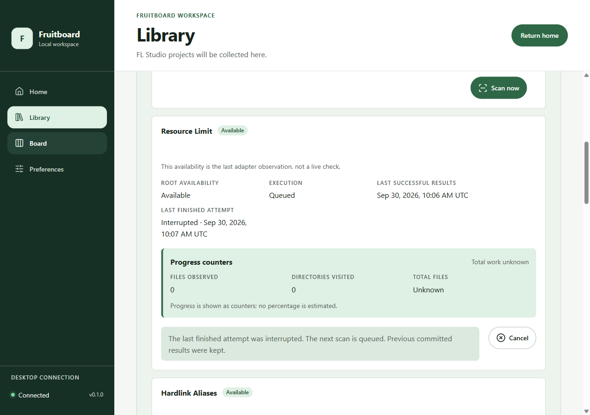
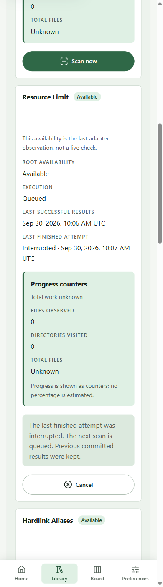

# Installed scanner recovery review — 2026-09-30

Status: **All 11 installed local-NTFS cases passed; P2-08 remains Partial.**

Related: #228, PR #229, #38, #40. This record adds current installed
queued/recovery presentation evidence to the September 21 residual. It does
not accept the full criterion or enable production scanning.

## Source and build boundary

The installed application was built from
`62e1084cccd86e5ef3ce63ae487cda7662c1aaba`, tree
`f25035895a44781c5567ccc1e57384b1b336f09b`.
The final installed driver/wrapper source was
`adf547e13853286acea73002b01236c88131f64f`. Its only changes after
the build commit are screenshot validation/framing in the installed driver;
the application, crates, packages, manifests, lockfiles and toolchain inputs
are byte-identical. No additional application build was needed for that
validation-only change. PR #227's parser supervisor is outside this boundary.

Build command, using the pinned Windows environment and explicit shared target:

```text
pnpm --filter @fruitboard/desktop exec tauri build --ci --no-sign --config src-tauri/tauri.package.conf.json --features packaging-smoke,scan-console --bundles nsis
```

| Artifact                       | SHA-256                                                            |
| ------------------------------ | ------------------------------------------------------------------ |
| NSIS installer                 | `5e1fb218bc2ae8e8e58979c6163b8dff3eec661a5571a115a42a12c370f4e318` |
| Installed application          | `68ae8cc47b7851b0fc47644c2c6d6ba701abf8095bdf3b2790cfb72e2acb1db7` |
| Inert foundation smoke sidecar | `f16f1f0418a106877990cc2949e4589545b214a3601c4a1940e4991258e45ec1` |

The supported `scripts/run-installed-ntfs-cases.ps1` wrapper installed that
recorded package, held its exclusive host lock, generated synthetic fixtures,
ran the journey, inspected copied databases, restored denied-directory ACLs,
stopped the application, uninstalled the package and released the lock.
The wrapper now honors `CARGO_TARGET_DIR` for bundle lookup and containment.

## Results

The final journey ran on September 30 and finished at **10:09:21 UTC**.
Its driver reports `pass: true`, no failures, and local NTFS only.
The final copied database passed its read-only integrity check (`ok`), with
SHA-256 `8db92d0d08ae2dfb3f2590a3c11ad8711c41f1d2737470e8a8baf9f7ac9315c7`.

| Installed case                                  | Result |
| ----------------------------------------------- | ------ |
| Baseline commits and visible UI journey         | Passed |
| Cancellation with background/periodic triggers  | Passed |
| Interrupted follow-up presentation              | Passed |
| Explicit cancellation/manual ordering and retry | Passed |
| Retry while running                             | Passed |
| Restart recovery                                | Passed |
| Denied traversal                                | Passed |
| Resource limit                                  | Passed |
| Hardlink aliases                                | Passed |
| Exhausted retries                               | Passed |
| Root lifecycle                                  | Passed |

The visible cancellation journey reproduced an accessibility defect in the
first run: cancellation was acknowledged while the worker still ran, and the
short focus timer expired before Scan now returned. The fix retains the
pending focus intent until an actionable control exists in a later status
render. A delayed-completion regression test and both subsequent installed
runs verify focus returns to Scan now while 20 committed rows remain unchanged.

For recovery, a real running scan received a coalesced follow-up request. The
old attempt finished as `interrupted` with safe code `conflict`; its successor
was queued. Native status and the rendered card agreed on the old attempt and
the current execution at **10:07:29 UTC**. Both captures show `Queued`,
`Last finished attempt: Interrupted`, the recovery explanation and Cancel.
The committed page remained byte-for-byte equivalent to its baseline response;
the successor subsequently completed. No scan was delayed to hold this state.

Desktop (1280 × 900), with synthetic absolute paths hidden:



Narrow (390 × 1400), with the complete message and Cancel control visible:



The published images were independently copied from browser captures after
computed-style validation confirmed every scan path was hidden. Raw images,
accessibility trees, opaque identifiers and host paths remain outside Git.
Windows SendKeys keyboard traversal and targeted axe 4.13.0 checks ran in the
recovery journey. The seven tested rules had no violations or incomplete
results; this is scoped evidence, not a blanket accessibility certification.

## Checks and remaining boundary

- Storage: 100 tests; the history query uses the existing root-local index
  without a table scan or temporary sort.
- Feature-enabled native scan console: 114 tests and warning-denied Clippy.
- Client: 158 tests, lint and type checks, including delayed cancellation
  focus, recovery history, native decoding and fake-adapter accessibility.
- Full pinned Windows `pnpm check` passed on the preceding implementation.
  Subsequent client changes passed focused checks; unchanged native code
  retains those results. Every updated PR head still requires its normal CI.
- First installed run failed the focus regression and an incorrect new-driver
  CDP invocation. Both were fixed. Two subsequent full installed runs passed.
  The final driver also verifies screenshot masking and improves narrow framing.

The current queued capture and interruption explanation are now installed-native
evidence. The live execution is honestly queued/running, rather than falsely
labelled interrupted; completing the successor replaces the one-entry history.
This is not a persistent scan-history browser.

Installed `unsupported` and `worker_failed` presentation remain unproduced.
The local NTFS fixture boundary supplies no unsupported filesystem, and there
is no controlled installed worker-failure producer in this journey. This work
adds neither filesystem virtualization nor a native fault-injection command.
FAT32, DriveFS and network shares remain excluded/unverified (#47/#48).
No performance qualification, quota change, migration, production activation,
full P2-08 acceptance, or closure of #38/#40 follows from these results.

## Retention and host handoff

The selected reusable writable cache is the existing `bounded-probes`
validation cache, owned solely by **Codex /root**. Its absolute path, free
capacity, isolation audits, installer copy/hash, build logs and raw journeys
are in the local task handoff outside disposable compiler output. Preflights
preserved the 30 GiB reserve with 2 GiB additional output budgeted; no second
cache or hardlink clone was created. The primary checkout/cache and previous
parser work remain intact. No source, fixture, database or retained evidence
was deleted. Installed test cleanup is complete; compiler intermediates remain
reusable and can be inventoried separately before any future cleanup.
