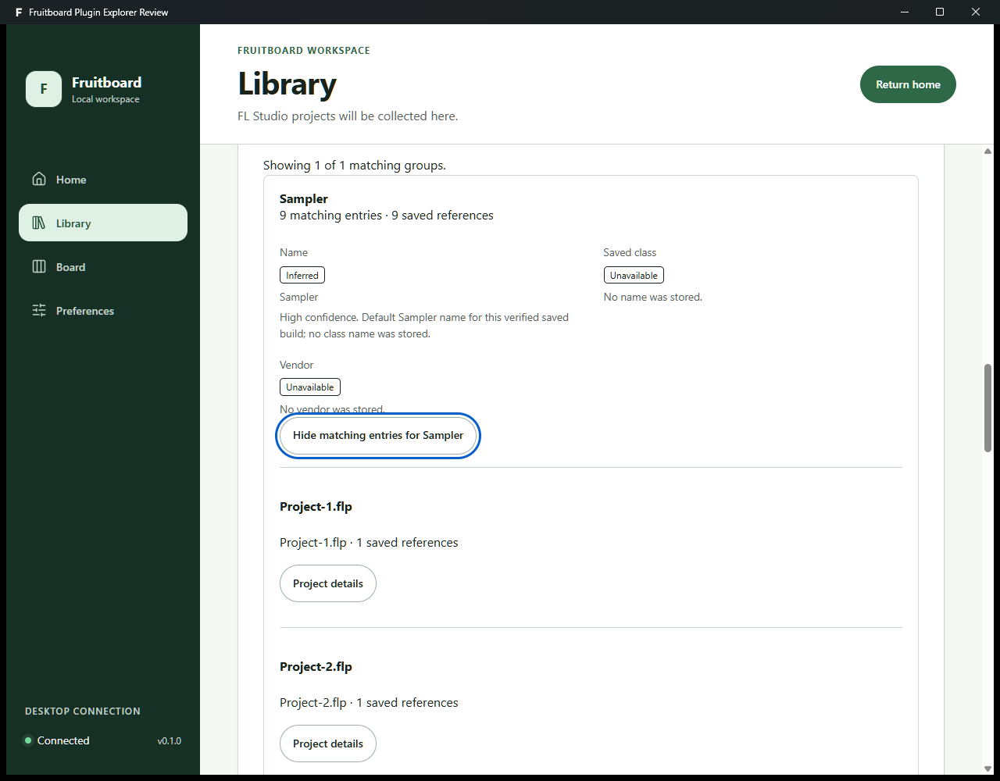
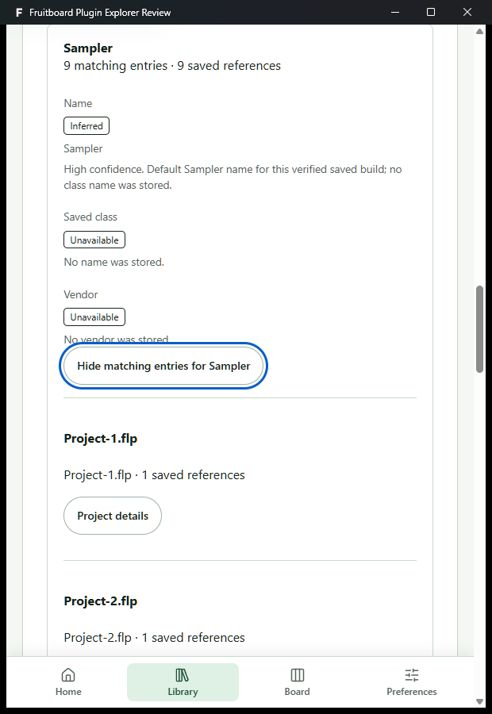
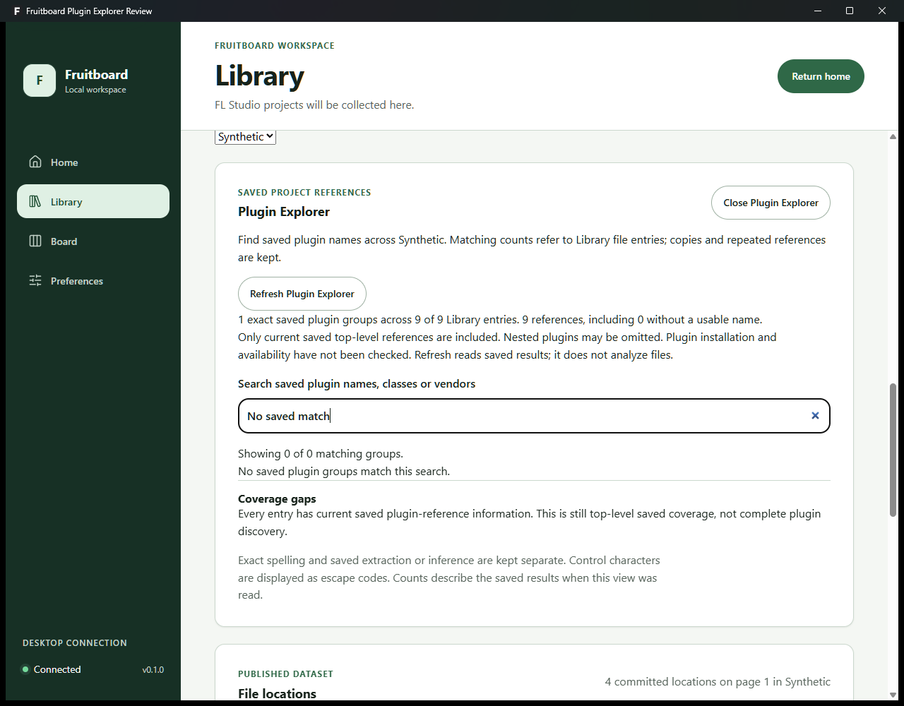

# Saved Plugin Explorer review

Issue: #254. Source boundary: the focused Plugin Explorer changes above merged
PR #256 (`60a796f519e2dfe56bf38098e91235aba1f3f1cc`). This is a Phase 2 follow-up;
it does not accept a later phase or change existing parser compatibility claims.

## Behavior

Library now offers an on-demand Plugin Explorer for its selected scan root.
It reads current, validated saved analysis in one SQLite read snapshot. Opening
or refreshing this view does not start analysis, read FLP bytes, discover
installed plugins, load a plugin, or send saved names outside the app.

Each group keeps the exact saved name, class and vendor, including every field's
extraction or inference status and provenance. Case changes, vendor differences
and provenance differences remain separate groups. Search filters those groups
without changing their identities or totals.

Matching counts describe distinct Library file entries; reference counts keep
repeated references within each entry. Copies remain separate file entries.
Matching-entry disclosures also offer the existing saved project-details panel.
Missing files, stale history, absent current analysis, older results without
plugin fields, invalid saved display details and unnamed references are explicit
coverage gaps. Coverage remains limited to saved top-level references; neither
a zero count nor complete saved coverage proves complete plugin discovery.

## Fixed query budgets

| Boundary | Maximum |
| --- | --- |
| Selected root's committed file entries | 2,000 |
| Accumulated current saved metadata input | 8 MiB |
| Current plugin references, including unnamed references | 8,192 |
| Exact named groups | 1,024 |
| Client response | 2 MiB |

The native projection reserves 1 KiB within the response ceiling for its root ID
and wrapper. Exceeding any budget returns only a limited state, without partial
groups, totals or matching lists. This is bounded availability, not performance
qualification or a claim that every large Library fits this view.

Groups, matching entries and coverage gaps render 20 items at a time with
accessible controls to show more. Refresh and source/root changes discard old
results; late success or failure replies cannot replace the newer view.

## Validation

Pinned Windows toolchain: Node 24.20.0, pnpm 11.25.0, Rust 1.98.1 MSVC.

```text
pnpm check
cargo test --workspace --features fruitboard-desktop/analysis-jobs --locked
cargo clippy --workspace --all-targets --features fruitboard-desktop/analysis-jobs --locked -- -D warnings
cargo test -p fruitboard-desktop --features scan-console --locked
cargo clippy -p fruitboard-desktop --all-targets --features scan-console --locked -- -D warnings
```

`pnpm check` includes 329 passing client tests, default native tests, denied-warning
lint, formatting, types, privacy checks, embedded SQLite verification and the
production build. Focused coverage checks native request privacy, real storage
publication and freshness, exact groups and duplicate counts, disabled/unknown
roots, input/entry/reference/group/output budgets, malformed cross-root replies,
inert hostile saved text, refresh/root/close races and loading/empty/error/limited
states. Client accessibility checks require zero axe violations or incomplete
results; contrast is checked visually because jsdom cannot measure it.

The approved parser fixtures remain byte-identical. There is no schema migration,
new dependency, plugin execution permission or broader filesystem capability.
The new native permission accepts only an opaque root ID and reads existing
local saved data. Rolling back the app leaves the saved database schema intact.

## Visual evidence

Screenshots capture the actual Windows app built with `analysis-jobs`, in a
separate, fresh review identity. Its roots contain only approved sample copies
and an empty synthetic folder. Startup reconciliation analyzed the nine copies
and replaced the constructed setup facts with current real saved Sampler results.
These images therefore show nine separate Library entries with one reference
each, preserving the parser's explicit Sampler inference and unavailable vendor.
They are not installed-app, owner-project or performance qualification evidence.
The owner's running app and profiles were not replaced or restored.

Desktop matching entries (1280-pixel window):



Narrow matching entries (620-pixel window):



Search with no matches retains the complete saved-coverage explanation:



Keyboard activation, visible focus, wrapping, labels and disclosures were checked
with synthetic data. Native screenshots cover ready/matching/search-empty states;
the deterministic client tests additionally cover missing/older/unnamed gaps,
loading, unavailable, disabled, error and limited states.

The opt-in ignored native fixture test refuses any existing destination. It
creates only a fresh synthetic review profile and is excluded from normal tests.
Private fixture profiles, build configurations, binaries, hashes and logs are
retained outside Git and outside the compiler cache.

## Deferred scope

Installed-plugin discovery, plugin launching, guessed aliases, nested discovery,
logical-project deduplication and unbounded aggregation remain excluded. The
existing FL Studio fixture compatibility limits continue to apply. The owner
still needs to review the feature PR before merge.
